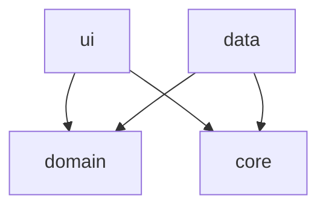

# Arquitectura Actual — Proyecto Restaurante

> [!info] MOC del proyecto
> Este nodo describe el estado **actual y real** de la arquitectura. Lo que *debería* ser está en [[Estándar de Ingeniería Android]]; la brecha entre ambos está en [[Deuda Técnica - Pendientes]].

> [!danger] Actualizado 2026-07-29 — Auditoría contra el estándar
> Se adoptó el [[Estándar de Ingeniería Android]] y se auditó la Fase 1 contra él. Resultado: **16 ítems de brecha**, entre ellos `minSdk = 37` (**P-003**), que hace que la app **no se instale en ningún teléfono real del mercado**. La remediación es la **Fase 0** de [[Roadmap de Fases]].

> [!success] Bootstrap 2026-07-29 — Bóveda + Fase 1 (Login)
> Proyecto Android (Java, esqueleto de Android Studio) + bóveda Obsidian construida sobre el patrón del proyecto Bimbo, con la arquitectura adaptada a mobile. Primer módulo: **Login** contra Supabase Auth vía REST/Retrofit, en la rama `feat/fase1-login`.

---

## Único módulo Gradle: `app`

A diferencia de un proyecto .NET con un proyecto/DLL por capa, acá **todo vive en el módulo Gradle `app`**, separado por **paquetes Java** que cumplen el mismo rol:

```
com.example.proyectofinalrestaurante
├── ui/       → Activities, ViewModels, estado de UI
├── domain/   → entidades, interfaces de repositorio, Result
├── data/     → implementaciones concretas (Retrofit, DTOs)
└── core/     → cliente HTTP/Supabase compartido
```

Ver [[ADR-001 - Arquitectura por capas (ui-domain-data) en Android con Java]] y [[Modularizacion por Feature]].

---

## Diagrama de dependencias



> [!warning] Regla
> `domain` **nunca** referencia `data`. La flecha va en sentido contrario: `data` implementa las interfaces que `domain` define. ✅ Se cumple hoy.

---

## Paquetes y responsabilidades

| Paquete | Rol | Depende de |
|---|---|---|
| `ui.login` | `LoginActivity`, `LoginViewModel`, `EstadoLogin`, `LoginViewModelFactory` | `domain` |
| `ui.recuperacion` | `SolicitarCodigo*`, `CambiarContrasenia*` (Activities + VMs + Factory + estados) | `domain` |
| `domain.model` | `Sesion` (id, correo, access token, **nombre**, rol) | — |
| `domain.repository` | `AuthRepository` (interfaz: login + logout + solicitarCodigo + verificarCodigo + cambiarContrasenia) | — |
| `domain` (raíz) | `Result<T>`, `RequisitoContrasenia`, `ResultadoValidacion`, `ValidadorContrasenia`, `VisibilidadMenu` | — |
| `data.remote` | `SupabaseAuthApi` (login/logout/recover/verify/user), `SupabasePerfilApi` (Retrofit), DTOs | `core` |
| `data.repository` | `SupabaseAuthRepository` | `domain`, `data.remote` |
| `core` | `SupabaseClient` (Retrofit singleton), `SesionActual` (sesión en memoria) | — |

---

## Entry point

- `AndroidManifest.xml`: `LoginActivity` es la actividad `LAUNCHER`.
- Login exitoso → `SesionActual.guardar(...)` + `startActivity(MainActivity)` + `finish()`.
- `MainActivity` es la pantalla post-login: **DrawerLayout + NavigationView con ítems filtrados por rol** (`domain/VisibilidadMenu`) y placeholder "Próximamente" para módulos no construidos. "Cerrar sesión" limpia `SesionActual` y vuelve al login con `CLEAR_TASK`.
- Desde el login, "¿Olvidaste tu contraseña?" → flujo de recuperación de 2 pasos (`SolicitarCodigoActivity` → `CambiarContraseniaActivity` → login).

> [!warning] Diverge del estándar
> El estándar pide **single-Activity + Fragments + Navigation Component**. Hoy son varias `Activity` con `Intent` explícito. Ver **P-015**.

---

## Configuración de build

| Parámetro | Valor actual | Objetivo del estándar |
|---|---|---|
| AGP | 9.2.1 | ✅ 9.x |
| Gradle | 9.4.1 | ✅ coincide con el mínimo de AGP 9.2 |
| `compileSdk` / `targetSdk` | 37 / 37 | ✅ ≥ 36 |
| **`minSdk`** | ✅ **24** — resuelto 2026-07-31 | ver **P-003** |
| Java source/target | ✅ **17** — resuelto 2026-07-31 | ver **P-006** |
| R8 en release | desactivado | 🟡 activado — ver **P-008** |
| Build DSL | Kotlin DSL + Version Catalog | ✅ |

Ver [[Toolchain Android 2026 - AGP, Gradle y JDK]] y [[Niveles de API y minSdk - Cobertura Real]].

---

## Patrones implementados

| Patrón | Dónde | Estado |
|---|---|---|
| [[Clean Architecture]] | `ui`/`domain`/`data`/`core` | ✅ Capas separadas; ⬜ sin `UseCase` todavía |
| [[Repository Pattern]] | `data.repository` | ✅ Implementado |
| [[Result Pattern]] | `domain.Result`, `SupabaseAuthRepository` | ✅ Básico; ⬜ sin `AppException` (**P-016**) |
| [[MVVM en Android (ViewModel + LiveData)]] | `ui.login`, `ui.recuperacion` | ✅ Implementado; ⚠️ `Executor` no inyectado en login (**P-005**) — en recuperación sí inyectado |
| [[UiState Inmutable y Flujo Unidireccional]] | `ui.login.EstadoLogin`, `ui.recuperacion.EstadoCambioContrasenia` | ✅ Estado único inmutable; ⚠️ login sin evento consumido (**P-013**) — recuperación sí lo consume |
| Regla de negocio en dominio | `domain.ValidadorContrasenia`, `domain.VisibilidadMenu` | ✅ Java puro, testeable con JUnit |
| Interceptor (Decorator) | `core.SupabaseClient` — header `apikey` | ✅ Implementado |
| [[Offline-First con Room y Outbox]] | — | ⬜ **No implementado** (**P-014**) |
| [[Base Repository con manejo de errores]] | — | ⬜ Documentado, no extraído (**P-001**) |
| DI con Hilt | — | ⬜ DI manual (**P-002**) |
| ViewBinding | — | ⬜ `findViewById` (**P-015**) |

---

## Módulos

| Módulo | Estado | Archivos clave |
|---|---|---|
| [[Módulo Login]] | 🟡 Funcional con deuda | `LoginActivity`, `LoginViewModel`, `SupabaseAuthRepository` |
| Recuperación de contraseña | 🟢 Funcional (Fase 1b) — falta verificación manual | `ui/recuperacion/*`, `ValidadorContrasenia` |
| Menú | ⬜ No iniciado — **primer módulo con Room/offline** | placeholder "Próximamente" en `MainActivity` |
| Pedidos | ⬜ No iniciado | — |
| Mesas | ⬜ No iniciado | — |
| Usuarios/Roles | ⬜ No iniciado | — |
| Reportes | ⬜ No iniciado | — |

Ver [[Roadmap de Fases]].

---

## Advertencias conocidas

1. ~~🔴 `minSdk = 37`~~ — ✅ resuelto el 2026-07-31 (**P-003**), ahora `minSdk = 24` (~96.6% de dispositivos). Falta la prueba en un teléfono físico real.
2. ~~🔴 `LoginActivity` sin manejo de insets~~ — ✅ resuelto el 2026-07-29 (**P-004**), pendiente de verse en un dispositivo real.
3. 🔴 **Sin arquitectura offline** — decisión obligada al arrancar la Fase 2 (**P-014**).
4. ⚠️ **Cero pruebas propias** — solo los ejemplos de Android Studio (**P-005**).
5. ~~⚠️ `SUPABASE_URL`/`SUPABASE_ANON_KEY` vacíos~~ — ✅ conectados el 2026-07-29 al proyecto real (**Restaurante**), con llave `anon` legada (falta generar la `sb_publishable_...`, **P-012**). `public.perfiles` con RLS ya existe; falta el usuario de prueba (manual).
6. ⚠️ `applicationId` sigue en `com.example.*` — Play lo rechaza y es irreversible tras publicar (**P-018**).

---

## Próximos pasos recomendados

1. **Verificar en emulador** la Fase 1b completa (login → drawer por rol → recuperación de 2 pasos); se necesita `local.properties` con credenciales de Supabase reales para la e2e.
2. **Fase 0** — cerrar la brecha crítica contra el estándar, empezando por **P-003**.
3. **Fase 2 (Menú)** — implementar Room + offline-first **desde el día uno** de ese módulo.
4. Extraer `BaseRepository` + `AppException` al agregar el segundo repositorio.
5. Decidir feature-first vs layer-first antes de que existan tres features → propuesta lista en [[Propuesta de División de Arquitectura]] (**P-017**).

---

## Relaciones

- [[Estándar de Ingeniería Android]]
- [[Deuda Técnica - Pendientes]]
- [[Roadmap de Fases]]
- [[Gate de Autoverificación]]
- [[Módulo Login]]
- [[Clean Architecture]]
