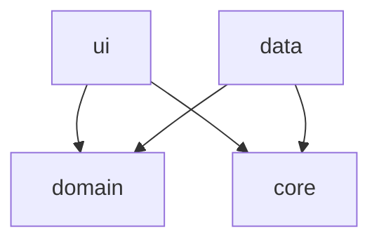

# Arquitectura Actual — Proyecto Restaurante

> [!info] MOC del proyecto
> Este nodo describe el estado actual de la arquitectura. Para el contexto completo de Claude Code, ver [[CLAUDE]].

> [!success] Bootstrap 2026-07-29 — Bóveda + Fase 1 (Login)
> Proyecto Android (Java, esqueleto generado por Android Studio) + bóveda Obsidian bootstrapped a partir del patrón usado en el proyecto Bimbo (mismas convenciones de agentes/documentación, arquitectura adaptada a mobile). Primer módulo real: **Login** contra Supabase Auth vía REST/Retrofit, en la rama `feat/fase1-login`.

---

## Único módulo Gradle: `app`

A diferencia de un proyecto .NET con varios proyectos/DLL (uno por capa), acá **todo vive en el módulo Gradle `app`**, separado por **paquetes Java** que cumplen el mismo rol:

```
com.example.proyectofinalrestaurante
├── ui/       → Activities, ViewModels, adapters
├── domain/   → entidades, interfaces de repositorio, Result
├── data/     → implementaciones concretas (Retrofit, DTOs)
└── core/     → cliente HTTP/Supabase compartido
```

---

## Diagrama de dependencias



> [!warning] Regla
> `domain` **nunca** referencia `data`. La flecha va en sentido contrario: `data` implementa las interfaces que `domain` define.

---

## Paquetes y responsabilidades

| Paquete | Rol | Depende de |
|---|---|---|
| `ui.login` | `LoginActivity`, `LoginViewModel`, `EstadoLogin` | `domain` |
| `domain.model` | `Sesion` | — |
| `domain.repository` | `AuthRepository` (interfaz) | — |
| `domain` (raíz) | `Result<T>` | — |
| `data.remote` | `SupabaseAuthApi` (Retrofit), DTOs | `core` |
| `data.repository` | `SupabaseAuthRepository` | `domain`, `data.remote` |
| `core` | `SupabaseClient` (Retrofit singleton, `BuildConfig.SUPABASE_URL/ANON_KEY`) | — |

---

## Entry point

- `AndroidManifest.xml`: `LoginActivity` es la actividad `LAUNCHER`.
- Login exitoso → `startActivity(MainActivity)` + `finish()` (no se puede volver atrás al login con el botón back).
- `MainActivity` es la pantalla "post-login" (placeholder de Fase 1 — el home real se construye en fases siguientes).

---

## Patrones implementados

| Patrón | Dónde | Estado |
|---|---|---|
| [[Clean Architecture]] | `ui`/`domain`/`data`/`core` | ✅ Implementado (Fase 1) |
| [[Repository Pattern]] | `data.repository` | ✅ Implementado |
| [[Result Pattern]] | `domain.Result`, `SupabaseAuthRepository` | ✅ Implementado |
| [[MVVM en Android (ViewModel + LiveData)]] | `ui.login` | ✅ Implementado |
| [[Base Repository con manejo de errores]] | — | ⬜ Documentado, no extraído (un solo repositorio todavía) |

---

## Módulos

| Módulo | Estado | Archivos clave |
|---|---|---|
| [[Módulo Login]] | 🟡 Fase 1 en curso | `LoginActivity`, `LoginViewModel`, `SupabaseAuthRepository` |
| Menú | ⬜ No iniciado | — |
| Pedidos | ⬜ No iniciado | — |
| Mesas | ⬜ No iniciado | — |
| Usuarios/Roles | ⬜ No iniciado | — |
| Reportes | ⬜ No iniciado | — |

Ver [[Roadmap de Fases]] para el orden planeado.

---

## Advertencias conocidas

- `SUPABASE_URL`/`SUPABASE_ANON_KEY` en `local.properties` están **vacíos por defecto** — hay que crear un proyecto Supabase real y completarlos antes de poder loguear de verdad. Ver [[Supabase Auth REST - Login Android]].
- `compileSdk`/`minSdk` = 37 y AGP 9.2.1 vienen del esqueleto generado por Android Studio — no se tocaron; revisar compatibilidad real del entorno de build antes de Fase 2.

---

## Próximos pasos recomendados

1. Completar y probar Fase 1 con un proyecto Supabase real.
2. **Fase 2 — Menú**: primer CRUD real, replicando [[Repository Pattern]] + [[Result Pattern]].
3. Extraer [[Base Repository con manejo de errores]] cuando exista un segundo repositorio.
4. Reevaluar DI manual vs. Hilt/Koin cuando el número de ViewModels/repositorios crezca.

---

## Relaciones

- [[Roadmap de Fases]]
- [[Módulo Login]]
- [[Deuda Técnica - Pendientes]]
