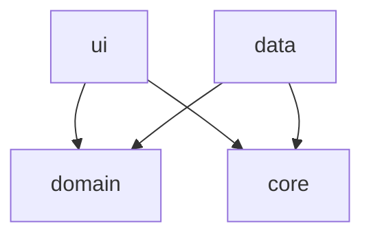

# Arquitectura Actual — Proyecto Restaurante

> [!info] MOC del proyecto
> Este nodo describe el estado **actual y real** de la arquitectura. Lo que *debería* ser está en [[Estándar de Ingeniería Android]]; la brecha entre ambos está en [[Deuda Técnica - Pendientes]].

> [!danger] Actualizado 2026-07-29 — Auditoría contra el estándar
> Se adoptó el [[Estándar de Ingeniería Android]] y se auditó la Fase 1 contra él. Resultado: **16 ítems de brecha**, entre ellos `minSdk = 37` (**P-003**), que hace que la app **no se instale en ningún teléfono real del mercado**. La remediación es la **Fase 0** de [[Roadmap de Fases]].

> [!success] Actualizado 2026-08-01 — Fase 2c/2d: Mesas y Clientes, Parte A y B completas
> `ui/mesas` y `ui/clientes` dejaron de leer de `DatosMaqueta` y hacen CRUD real contra Room
> + outbox, con sus sincronizadores sumados al `SyncWorker`. **345 tests** en verde. A mitad
> de sesión el usuario autorizó el MCP de Supabase, así que también se ejecutó y verificó la
> Parte A: catálogo `estado_mesa`, `vista_mesas`/`vista_clientes`, triggers y los dos RPC
> (`cambiar_estado_mesa`, `buscar_o_crear_cliente`) ya están en la base real, con las
> pruebas de aceptación de cada plan pasando contra roles simulados. Dos correcciones al
> DDL asumido: `mesa` no tenía `numero_mesa`/`ubicacion` (se agregaron) y `clientes` usa
> `nombres`/`apellidos` en plural (se corrigió el DTO de Android). Ver [[Módulo Mesas]],
> [[Módulo Clientes]] y [[ADR-007 - Estados operativos en catálogos propios, separados de estado_general]].

> [!success] Actualizado 2026-07-31 — Fase 2a: el Menú es un módulo real
> `ui/menu` dejó de leer de `DatosMaqueta` y ahora hace CRUD contra Supabase, con las fotos
> de los platillos en el bucket `platillos` de Storage. Es el **tercer** módulo funcional
> (login, empleados, menú) y el primero que orquesta dos sistemas —base y Storage— que
> pueden desincronizarse. Ver [[Módulo Menú]] y
> [[Sesión 2026-07-31 - Fase 2a implementada (CRUD de Menú con fotos en Storage)]].

> [!success] Bootstrap 2026-07-29 — Bóveda + Fase 1 (Login)
> Proyecto Android (Java, esqueleto de Android Studio) + bóveda Obsidian construida sobre el patrón del proyecto Bimbo, con la arquitectura adaptada a mobile. Primer módulo: **Login** contra Supabase Auth vía REST/Retrofit, en la rama `feat/fase1-login`.

---

## Único módulo Gradle: `app`

A diferencia de un proyecto .NET con un proyecto/DLL por capa, acá **todo vive en el módulo Gradle `app`**, separado por **paquetes Java** que cumplen el mismo rol:

```
com.example.proyectofinalrestaurante
├── ui/       → Activities, ViewModels, estado de UI
├── domain/   → entidades, interfaces de repositorio, Result
├── data/     → implementaciones concretas (Retrofit, DTOs)
└── core/     → cliente HTTP/Supabase compartido
```

Ver [[ADR-001 - Arquitectura por capas (ui-domain-data) en Android con Java]] y [[Modularizacion por Feature]].

---

## Diagrama de dependencias



> [!warning] Regla
> `domain` **nunca** referencia `data`. La flecha va en sentido contrario: `data` implementa las interfaces que `domain` define. ✅ Se cumple hoy.

---

## Paquetes y responsabilidades

| Paquete | Rol | Depende de |
|---|---|---|
| `ui.login` | `LoginActivity`, `LoginViewModel`, `EstadoLogin`, `LoginViewModelFactory` | `domain` |
| `ui.recuperacion` | `SolicitarCodigo*`, `CambiarContrasenia*` (Activities + VMs + Factory + estados) | `domain` |
| `ui.empleados` | `EmpleadosFragment`, `EmpleadoAdapter`, `EmpleadosViewModel`, `EstadoEmpleados`, Factory, `FormularioEmpleadoDialog` | `domain` |
| `ui.menu` | `MenuFragment`, `PlatilloAdapter`, `MenuViewModel`, `EstadoMenu`, Factory, `FormularioPlatilloDialog`, `CategoriasDialog`, `UrlDeImagen`, `CompresorDeImagen` | `domain` |
| `ui.mesas` | `MesasFragment`, `MesaAdapter`, `MesasViewModel`, `EstadoMesas`, Factory, `FormularioMesaDialog`, `EstadoMesaUi` | `domain` |
| `ui.clientes` | `ClientesFragment`, `ClienteAdapter`, `ClientesViewModel`, `EstadoClientes`, Factory, `FormularioClienteDialog` | `domain` |
| `ui.permisos` | `VistaPorPermiso` — aplica la matriz de permisos sobre vistas y menús | `domain` |
| `domain.model` | `Sesion`, `Empleado`, `NuevoEmpleado`, `Platillo`, `NuevoPlatillo`, `Categoria`, `ImagenPlatillo`, `Mesa`, `NuevaMesa`, `EstadoMesa`, `Cliente`, `NuevoCliente` | — |
| `domain.repository` | `AuthRepository`, `EmpleadoRepository`, `MenuRepository`, `MesaRepository`, `ClienteRepository` | — |
| `domain` (raíz) | `Result<T>`, `Permisos`, `Modulo`, `Accion`, `RequisitoContrasenia`, `ResultadoValidacion`, `ValidadorContrasenia`, `ValidadorPlatillo`, `ValidadorMesa`, `ValidadorCliente`, `ReglasEmpleado`, `ReglasMenu`, `ReglasMesa`, `ReglasCliente`, `VisibilidadMenu` | — |
| `data.remote` | `SupabaseAuthApi`, `SupabasePerfilApi`, `SupabaseEmpleadoApi`, `SupabaseMenuApi`, `SupabaseMesaApi`, `SupabaseClienteApi` (PostgREST), `SupabaseStorageApi` (bucket `platillos`), DTOs | `core` |
| `data.repository` | `SupabaseAuthRepository`, `EmpleadoRepositorioLocal` + `EmpleadoRemoto`, `MenuRepositorioLocal` + `MenuRemoto`, `MesaRepositorioLocal` + `MesaRemoto`, `ClienteRepositorioLocal` + `ClienteRemoto` | `domain`, `data.remote`, `data.local` |
| `data.sync` | `SyncWorker` (único), `SincronizadorMenu`, `SincronizadorEmpleados`, `SincronizadorMesas`, `SincronizadorClientes`, `Outbox`, `ClasificadorDeError` | `data.local`, `data.remote` |
| `core` | `SupabaseClient` (Retrofit singleton; expone auth/perfil/empleado/menu/mesa/cliente/storage), `SesionActual` (sesión en memoria), `SyncApplication` (composition root) | — |

---

## Entry point

- `AndroidManifest.xml`: `LoginActivity` es la actividad `LAUNCHER`.
- Login exitoso → `SesionActual.guardar(...)` + `startActivity(MainActivity)` + `finish()`.
- `MainActivity` es la pantalla post-login: **DrawerLayout + NavigationView con ítems filtrados por rol** (`domain/VisibilidadMenu`) y placeholder "Próximamente" para módulos no construidos. "Cerrar sesión" limpia `SesionActual` y vuelve al login con `CLEAR_TASK`.
- Desde el login, "¿Olvidaste tu contraseña?" → flujo de recuperación de 2 pasos (`SolicitarCodigoActivity` → `CambiarContraseniaActivity` → login).

> [!warning] Diverge del estándar
> El estándar pide **single-Activity + Fragments + Navigation Component**. Hoy son varias `Activity` con `Intent` explícito. Ver **P-015**.

---

## Configuración de build

| Parámetro | Valor actual | Objetivo del estándar |
|---|---|---|
| AGP | 9.2.1 | ✅ 9.x |
| Gradle | 9.4.1 | ✅ coincide con el mínimo de AGP 9.2 |
| `compileSdk` / `targetSdk` | 37 / 37 | ✅ ≥ 36 |
| **`minSdk`** | ✅ **24** — resuelto 2026-07-31 | ver **P-003** |
| Java source/target | ✅ **17** — resuelto 2026-07-31 | ver **P-006** |
| R8 en release | desactivado | 🟡 activado — ver **P-008** |
| Build DSL | Kotlin DSL + Version Catalog | ✅ |

Ver [[Toolchain Android 2026 - AGP, Gradle y JDK]] y [[Niveles de API y minSdk - Cobertura Real]].

---

## Patrones implementados

| Patrón | Dónde | Estado |
|---|---|---|
| [[Clean Architecture]] | `ui`/`domain`/`data`/`core` | ✅ Capas separadas; ⬜ sin `UseCase` todavía |
| [[Repository Pattern]] | `data.repository` | ✅ Implementado |
| [[Result Pattern]] | `domain.Result`, `SupabaseAuthRepository` | ✅ Básico; ⬜ sin `AppException` (**P-016**) |
| [[MVVM en Android (ViewModel + LiveData)]] | `ui.login`, `ui.recuperacion`, `ui.empleados`, `ui.menu` | ✅ Implementado, con `Executor` inyectado (**P-005** resuelto) |
| [[UiState Inmutable y Flujo Unidireccional]] | `EstadoLogin`, `EstadoCambioContrasenia`, `EstadoEmpleados`, `EstadoMenu` | ✅ Estado único inmutable, con evento de éxito de un solo disparo (**P-013** resuelto) |
| Regla de negocio en dominio | `ValidadorContrasenia`, `ValidadorPlatillo`, `VisibilidadMenu`, `Permisos`, `ReglasEmpleado`, `ReglasMenu` | ✅ Java puro, testeable con JUnit |
| Interceptor (Decorator) | `core.SupabaseClient` — `apikey` siempre; `Content-Type` JSON solo si el cuerpo no trae el suyo | ✅ Corregido en Fase 2a: forzarlo rompía las subidas binarias a Storage |
| Carga de imágenes | Glide 4.16.0 en `PlatilloAdapter` y `FormularioPlatilloDialog` | ✅ Fase 2a; ruta UUID nueva por reemplazo para no pelear con el caché |
| [[Offline-First con Room y Outbox]] | `data/local` (Room v4), `data/outbox` (particionado por módulo), `data/sync` (`SyncWorker` único) | ✅ **Implementado**: Menú, Empleados, Mesas y Clientes son local-first. **P-014 cerrado**. Mesas/Clientes: código listo, sin servidor real contra el que sincronizar todavía |
| [[Base Repository con manejo de errores]] | — | ⬜ Documentado, no extraído (**P-001**) |
| DI con Hilt | — | ⬜ DI manual (**P-002**) |
| ViewBinding | — | ⬜ `findViewById` (**P-015**) |

---

## Módulos

| Módulo | Estado | Archivos clave |
|---|---|---|
| [[Módulo Login]] | 🟡 Funcional con deuda | `LoginActivity`, `LoginViewModel`, `SupabaseAuthRepository` |
| Recuperación de contraseña | 🟢 Funcional (Fase 1b) — falta verificación manual | `ui/recuperacion/*`, `ValidadorContrasenia` |
| [[Módulo Menú]] | 🟢 **Funcional y local-first** (Fase 2a + 2b) — CRUD de platillos y categorías, fotos en Storage, Room + outbox. Falta la prueba en dispositivo | `ui/menu/*`, `MenuRepositorioLocal`, `SincronizadorMenu`, `SupabaseStorageApi` |
| Pedidos | ⬜ No iniciado — depende de Mesas y Clientes | — |
| [[Módulo Mesas]] | 🟢 **Funcional y local-first** (Fase 2c, 2026-08-01) — código (73 tests) y servidor verificados. Falta la prueba en dispositivo físico | `ui/mesas/*`, `MesaRepositorioLocal`, `SincronizadorMesas` |
| [[Módulo Empleados]] | 🟢 **Funcional y local-first** (Fase 1d + offline-first 2026-08-01) — Room + outbox; el alta exige conexión porque crea la cuenta de acceso | `ui/empleados/*`, `EmpleadoRepositorioLocal`, `SincronizadorEmpleados`, `supabase/functions/crear-empleado/` |
| [[Módulo Clientes]] | 🟢 **Funcional y local-first** (Fase 2d, 2026-08-01) — código (55 tests) y servidor verificados. Falta la prueba en dispositivo físico | `ui/clientes/*`, `ClienteRepositorioLocal`, `SincronizadorClientes` |
| Reportes | ⬜ No iniciado | — |

Ver [[Roadmap de Fases]].

---

## Advertencias conocidas

1. ~~🔴 `minSdk = 37`~~ — ✅ resuelto el 2026-07-31 (**P-003**), ahora `minSdk = 24` (~96.6% de dispositivos). Falta la prueba en un teléfono físico real.
2. ~~🔴 `LoginActivity` sin manejo de insets~~ — ✅ resuelto el 2026-07-29 (**P-004**), pendiente de verse en un dispositivo real.
3. ~~🔴 **Sin arquitectura offline**~~ — ✅ resuelto el 2026-08-01 (**P-014**): Menú y Empleados son local-first sobre Room + outbox + `SyncWorker` único. El login queda fuera por definición (autenticar exige red); lo suyo es **P-009**.
4. ~~⚠️ **Cero pruebas propias**~~ — ✅ resuelto el 2026-07-31 (**P-005**/**P-020**): la suite creció de 124 (Fase 0) a 217 (Fase 2b, 2026-08-01: DAOs con Robolectric, outbox particionado, sincronizadores, migración v1→v2) a **345 tests** al cerrar la Parte B de Mesas y Clientes (2026-08-01). `CompresorDeImagen` sigue sin cobertura (**P-024**).
5. ~~⚠️ `SUPABASE_URL`/`SUPABASE_ANON_KEY` vacíos~~ — ✅ conectados el 2026-07-29 al proyecto real (**Restaurante**); la constante se renombró a `SUPABASE_PUBLISHABLE_KEY` el 2026-07-31 (**P-012** resuelto). `perfiles` con RLS y usuarios reales cargados.
6. ⚠️ `applicationId` sigue en `com.example.*` — Play lo rechaza y es irreversible tras publicar (**P-018**).
7. ~~🔴 Mesas y Clientes no funcionan de punta a punta~~ — ✅ resuelto el 2026-08-01: Parte A y Parte B completas y verificadas contra el servidor real. Falta la prueba en un dispositivo físico. Ver [[Módulo Mesas]], [[Módulo Clientes]].

---

## Próximos pasos recomendados

1. **Probar Mesas y Clientes en dispositivo**: dos sesiones (admin y mesero) para confirmar
   que los permisos se comportan distinto, y el flujo offline (cambiar el estado de una mesa
   en modo avión, ver "Sin subir", recuperar la red) sube solo. Es lo único que le falta a
   las dos fases — el servidor ya está verificado (Parte A y B completas, 2026-08-01).
2. **Verificar en dispositivo** el Menú de la Fase 2a: subir una foto real, verla en la lista, reemplazarla, quitarla, desactivar/reactivar un platillo y crear/borrar una categoría. `local.properties` ya tiene las credenciales reales.
3. **Cerrar la Fase 1**: solo falta verificar **P-004** en un teléfono físico. El login + Empleados en emulador y la política de contraseñas del dashboard (**S-2**) los cerró el usuario el 2026-08-01. Con P-004 se mergea `feat/fase1-login` a `master`.
4. **P-009** — persistir y refrescar el token. Es el próximo cuello de botella real del offline: sin sesión guardada, al reabrir la app hay que loguearse y el `SyncWorker` no drena la cola.
5. Extraer `BaseRepository` + `AppException` (**P-001**/**P-016**): ya hay **cinco** repositorios con el mismo `mensajeDeError()` copiado.
6. Decidir feature-first vs layer-first — ya existen cinco features (`login`, `empleados`, `menu`, `mesas`, `clientes`), muy por encima del umbral que fijaba [[Propuesta de División de Arquitectura]] (**P-017**).
7. **Fase 3 (Pedidos en tiempo real)** — planificada el 2026-08-04, lista para ejecutarse: ver [[Plan Fase 3 - Pedidos en Tiempo Real]]. Mesas y Clientes, sus dependencias, están completas de punta a punta. La **toma** del pedido se difiere a una Fase 3b bloqueada por **P-026** (id de cliente offline) y **P-025**. Antes de empezar conviene leer **P-029**: el sincronizador nuevo debe copiar el delta del Menú, no el de Mesas.

---

## Relaciones

- [[Estándar de Ingeniería Android]]
- [[Deuda Técnica - Pendientes]]
- [[Roadmap de Fases]]
- [[Gate de Autoverificación]]
- [[Módulo Login]]
- [[Módulo Menú]] · [[Módulo Empleados]] · [[Módulo Mesas]] · [[Módulo Clientes]]
- [[Clean Architecture]]
