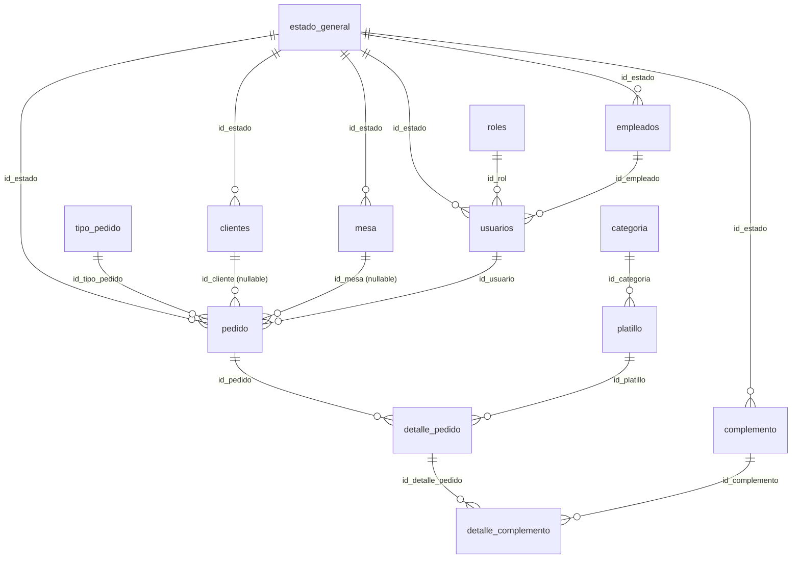

# Esquema de Base de Datos — proyecto Restaurante

> [!info] Estado
> Aplicado el **2026-07-29** sobre el proyecto Supabase **Restaurante** (`mxarlisuueovxvttytcm`), esquema `public`. **14 tablas**, todas con **RLS activa**. Todas vacías (0 filas) — falta cargar los catálogos base.

---

## Diagrama de relaciones



---

## Tablas por grupo

| Grupo | Tablas |
|---|---|
| **Catálogos base** (sin dependencias) | `estado_general`, `roles`, `categoria`, `tipo_pedido`, `empresa` |
| **Personas y acceso** | `empleados`, `usuarios`, `clientes` |
| **Productos y mesas** | `mesa`, `platillo`, `complemento` |
| **Pedidos** | `pedido`, `detalle_pedido`, `detalle_complemento` |
| **Auth (preexistente)** | `perfiles` — enlazada a `auth.users`, ver [[Módulo Login]] |

Convención: PK `id_<tabla>` con `INT GENERATED ALWAYS AS IDENTITY`, FK nombradas `fk_<tabla>_<referencia>`, únicos `uq_<tabla>_<campo>`. Todo en `snake_case` — el mapeo explícito a Java (camelCase) va en los DTOs, ver [[CLAUDE]].

---

## Seguridad — RLS

> [!danger] Estado actual: RLS activa, **sin políticas** = deny-all
> Las 14 tablas tienen `ENABLE ROW LEVEL SECURITY` pero **ninguna policy**. Eso significa que hoy la app **no puede leer ni escribir nada** en ellas desde el APK. Es el default correcto y deliberado: cada módulo agrega **sus** políticas en su propia fase (Menú → `platillo`/`categoria`, Pedidos → `pedido`/`detalle_*`, etc.), en la misma migración que el código que las consume.

El esquema original llegó sin RLS. Al aplicarlo, el linter de Supabase reportó **13 errores nivel ERROR** (`rls_disabled_in_public`): con la llave `anon` embebida en el APK, cualquiera que extraiga esa llave podía leer y escribir **toda** la base. Se corrigió en la migración `habilitar_rls_en_esquema_restaurante`. Ver [[Seguridad y Privacidad Android]].

Además se revocó `SELECT` al rol `anon` sobre `usuarios`, `empleados` y `clientes` — datos personales que no deben ser ni siquiera descubribles antes de iniciar sesión.

---

## ~~⚠️ Conflicto~~ ✅ Resuelto (2026-07-29) — `usuarios` enlazado a Supabase Auth

`public.usuarios` llegó con una columna propia **`contrasena VARCHAR(255)`**, en paralelo a `auth.users` + `public.perfiles` (que es lo que `SupabaseAuthRepository` ya usa). Antes de cargar ningún dato real se corrigió, con la tabla todavía vacía (migración segura, sin pérdida de datos):

```sql
ALTER TABLE public.usuarios
    DROP COLUMN contrasena,
    ADD COLUMN id_auth_user uuid NOT NULL REFERENCES auth.users(id) ON DELETE CASCADE,
    ADD CONSTRAINT uq_usuarios_auth_user UNIQUE (id_auth_user);
```

**Por qué esta forma y no otra:** Supabase Auth ya guarda las contraseñas con **bcrypt + salt aleatorio** en `auth.users.encrypted_password` — verificado contra la documentación oficial (*"Supabase Auth uses bcrypt... to store hashes of users' passwords. Only hashed passwords are stored."*, [supabase.com/docs — Password Security FAQ](https://supabase.com/docs/guides/auth/passwords)). Mantener una columna `contrasena` propia habría significado reimplementar hashing, salt, política de fuerza, rate limiting y recuperación — exactamente lo que Bimbo señaló como trabajo pendiente real en su `Plan de Seguridad - Roadmap 10-10` ([[Seguridad y Privacidad Android]], sección 7). La mejor "encriptación" acá es **no tener una propia**: delegar 100% en Supabase Auth y que `usuarios` sea solo el registro de negocio (rol, empleado, estado) enlazado por `uuid`.

`usuarios` ahora tiene su propia policy RLS (`select` para `authenticated` sobre `auth.uid() = id_auth_user`), mismo patrón que `perfiles`.

| | `auth.users` + `perfiles` | `usuarios` (después del fix) |
|---|---|---|
| PK | `uuid` | `INT` identity |
| Credencial | Supabase Auth (bcrypt) | — (ninguna, no aplica) |
| Enlace | — | `id_auth_user uuid` → `auth.users.id` |
| Rol | `perfiles.rol` (check) | `usuarios.id_rol` → `roles` |
| ¿Lo usa el código Android hoy? | **Sí** — `SupabaseAuthRepository` | No todavía — pendiente de que el código lea `usuarios`/`empleados`/`roles` en vez de (o junto con) `perfiles` |

Sigue existiendo la pregunta de fondo — ¿`perfiles` y `usuarios` conviven, o `perfiles` se retira una vez que el código lea de `usuarios`? — pero ya no hay riesgo de contraseñas propias mal manejadas. Cerrado como **P-021** en [[Deuda Técnica - Pendientes]].

---

## Otras observaciones del esquema

| Observación | Detalle |
|---|---|
| `pedido.fecha` es `TIMESTAMP` | Sin zona horaria. En Supabase la convención es `TIMESTAMPTZ`; con `TIMESTAMP` a secas, un pedido registrado a las 19:00 en Honduras se lee distinto según el cliente. Recomendado migrar antes de cargar datos reales. |
| `empresa.logo_empresa` es `BYTEA` | Guardar imágenes en la fila infla la tabla y las respuestas de PostgREST. Supabase Storage es la ruta natural (igual que hizo Bimbo con `ServicioLogo`). |
| `uq_clientes_identidad UNIQUE (identidad)` | Correcto para "venta de mostrador": en Postgres los `NULL` no colisionan entre sí, así que puede haber muchos clientes sin identidad. **Decisión tomada:** el cliente no tiene login — ver [[ADR-006 - Clientes sin cuenta propia, captura de datos al pedido]]. |
| Catálogos vacíos | `estado_general`, `roles`, `categoria` y `tipo_pedido` son FK obligatorias de casi todo. **Sin filas ahí no se puede insertar nada más.** Es el primer `INSERT` que hay que hacer. |
| Sin `ON DELETE` explícito | Todas las FK usan el default `NO ACTION`. No se puede borrar un catálogo referenciado — probablemente lo deseado, pero conviene decidirlo explícitamente. |

---

## Catálogos cargados

| Tabla | Filas |
|---|---|
| `roles` | `1=admin, 2=mesero, 3=cocina` (2026-07-29) — mismos 3 valores que el `CHECK` de `perfiles.rol` |
| `estado_general` | `1=Activo, 2=Inactivo` (2026-07-29) — mínimo para desbloquear `empleados`/`usuarios`/`clientes`. **`mesa` y `pedido` van a necesitar estados más específicos** (libre/ocupada/reservada; pendiente/en preparación/listo/entregado/cancelado) — pendiente de decidir si se agregan acá o se separan en catálogos propios. |
| `categoria`, `tipo_pedido` | ⬜ Vacíos |

## Pendiente inmediato

1. ~~Cargar `roles`~~ ✅ Hecho. ~~Cargar `estado_general` (mínimo)~~ ✅ Hecho. **Cargar** `categoria`, `tipo_pedido`.
2. **Resolver P-021** — decidir si `usuarios` reemplaza a `perfiles`, si convive enlazada por `uuid`, o si se elimina.
3. **Políticas RLS por módulo** — a medida que cada fase de [[Roadmap de Fases]] consuma sus tablas.
4. Evaluar `TIMESTAMP` → `TIMESTAMPTZ` en `pedido.fecha` antes de que haya datos.

---

## Relaciones

- [[Plan de Conexión con Supabase]]
- [[Módulo Login]]
- [[Seguridad y Privacidad Android]]
- [[Deuda Técnica - Pendientes]] — P-021
- [[Roadmap de Fases]]
- [[Arquitectura Actual]]
- [[Propuesta de División de Arquitectura]]
