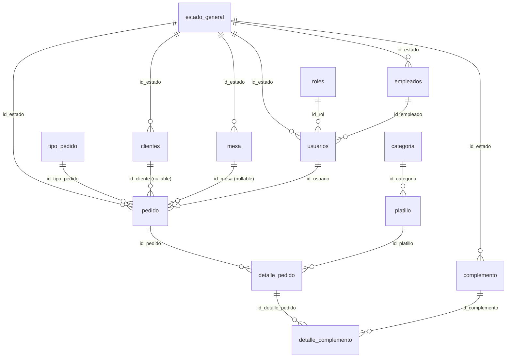

# Esquema de Base de Datos — proyecto Restaurante

> [!info] Estado
> Aplicado el **2026-07-29** sobre el proyecto Supabase **Restaurante** (`mxarlisuueovxvttytcm`), esquema `public`. **16 tablas** (se sumó `estado_mesa` el 2026-08-01 y `estado_pedido` el 2026-08-05), todas con **RLS activa** y con policies por módulo. Catálogos base cargados, incluido `tipo_pedido`. Desde el **2026-07-31** hay además un bucket de Storage (`platillos`) — ver la sección de Fase 2a más abajo.
>
> **2026-08-01 — Parte A de Mesas y Clientes ejecutada.** El DDL real de `mesa` y `clientes` está documentado más abajo. Detalle completo de las migraciones, la verificación por rol y las dos correcciones al plan en [[Módulo Mesas]], [[Módulo Clientes]] y [[ADR-007 - Estados operativos en catálogos propios, separados de estado_general]].
>
> **2026-08-05 — Parte A de Pedidos (Fase 3) ejecutada.** El DDL real de `pedido`,
> `detalle_pedido` y el catálogo nuevo `estado_pedido` está documentado más abajo. Detalle
> completo en [[Plan Fase 3 - Pedidos en Tiempo Real]] §2 y
> [[ADR-008 - Tiempo real como señal, por Broadcast desde la base]].

---

## Diagrama de relaciones



---

## Tablas por grupo

| Grupo | Tablas |
|---|---|
| **Catálogos base** (sin dependencias) | `estado_general`, `roles`, `categoria`, `tipo_pedido`, `empresa` |
| **Personas y acceso** | `empleados`, `usuarios`, `clientes` |
| **Productos y mesas** | `mesa`, `platillo`, `complemento` |
| **Pedidos** | `pedido`, `detalle_pedido`, `detalle_complemento` |
| **Auth (preexistente)** | `perfiles` — enlazada a `auth.users`, ver [[Módulo Login]] |

Convención: PK `id_<tabla>` con `INT GENERATED ALWAYS AS IDENTITY`, FK nombradas `fk_<tabla>_<referencia>`, únicos `uq_<tabla>_<campo>`. Todo en `snake_case` — el mapeo explícito a Java (camelCase) va en los DTOs, ver [[CLAUDE]].

---

## Seguridad — RLS

> [!success] Estado actual (2026-07-31): RLS activa **con** políticas por rol
> El arranque fue deny-all deliberado (RLS activa, cero policies). Hoy las 14 tablas ya
> tienen sus políticas, todas apoyadas en la función `rol_actual()` — que lee
> `perfiles.rol` del `auth.uid()` de la sesión **y exige `activo = true`**, así que un
> empleado desactivado no lee ni escribe nada.
>
> Para `platillo` y `categoria`: **leer** puede cualquier rol con sesión activa;
> **escribir** solo `admin`. Ver [[Plan Fase 2a - CRUD de Platillos y Categorias]].

El esquema original llegó sin RLS. Al aplicarlo, el linter de Supabase reportó **13 errores nivel ERROR** (`rls_disabled_in_public`): con la llave `anon` embebida en el APK, cualquiera que extraiga esa llave podía leer y escribir **toda** la base. Se corrigió en la migración `habilitar_rls_en_esquema_restaurante`. Ver [[Seguridad y Privacidad Android]].

Además se revocó `SELECT` al rol `anon` sobre `usuarios`, `empleados` y `clientes` — datos personales que no deben ser ni siquiera descubribles antes de iniciar sesión.

---

## ~~⚠️ Conflicto~~ ✅ Resuelto (2026-07-29) — `usuarios` enlazado a Supabase Auth

`public.usuarios` llegó con una columna propia **`contrasena VARCHAR(255)`**, en paralelo a `auth.users` + `public.perfiles` (que es lo que `SupabaseAuthRepository` ya usa). Antes de cargar ningún dato real se corrigió, con la tabla todavía vacía (migración segura, sin pérdida de datos):

```sql
ALTER TABLE public.usuarios
    DROP COLUMN contrasena,
    ADD COLUMN id_auth_user uuid NOT NULL REFERENCES auth.users(id) ON DELETE CASCADE,
    ADD CONSTRAINT uq_usuarios_auth_user UNIQUE (id_auth_user);
```

**Por qué esta forma y no otra:** Supabase Auth ya guarda las contraseñas con **bcrypt + salt aleatorio** en `auth.users.encrypted_password` — verificado contra la documentación oficial (*"Supabase Auth uses bcrypt... to store hashes of users' passwords. Only hashed passwords are stored."*, [supabase.com/docs — Password Security FAQ](https://supabase.com/docs/guides/auth/passwords)). Mantener una columna `contrasena` propia habría significado reimplementar hashing, salt, política de fuerza, rate limiting y recuperación — exactamente lo que Bimbo señaló como trabajo pendiente real en su `Plan de Seguridad - Roadmap 10-10` ([[Seguridad y Privacidad Android]], sección 7). La mejor "encriptación" acá es **no tener una propia**: delegar 100% en Supabase Auth y que `usuarios` sea solo el registro de negocio (rol, empleado, estado) enlazado por `uuid`.

`usuarios` ahora tiene su propia policy RLS (`select` para `authenticated` sobre `auth.uid() = id_auth_user`), mismo patrón que `perfiles`.

| | `auth.users` + `perfiles` | `usuarios` (después del fix) |
|---|---|---|
| PK | `uuid` | `INT` identity |
| Credencial | Supabase Auth (bcrypt) | — (ninguna, no aplica) |
| Enlace | — | `id_auth_user uuid` → `auth.users.id` |
| Rol | `perfiles.rol` (check) | `usuarios.id_rol` → `roles` |
| ¿Lo usa el código Android hoy? | **Sí** — `SupabaseAuthRepository` | No todavía — pendiente de que el código lea `usuarios`/`empleados`/`roles` en vez de (o junto con) `perfiles` |

Sigue existiendo la pregunta de fondo — ¿`perfiles` y `usuarios` conviven, o `perfiles` se retira una vez que el código lea de `usuarios`? — pero ya no hay riesgo de contraseñas propias mal manejadas. Cerrado como **P-021** en [[Deuda Técnica - Pendientes]].

---

## Otras observaciones del esquema

| Observación | Detalle |
|---|---|
| ~~`pedido.fecha` es `TIMESTAMP`~~ ✅ Corregido 2026-08-05 | Migrada a `timestamptz` (`at time zone 'America/Tegucigalpa'` para el backfill) como parte de la Parte A de Pedidos — ver más abajo. |
| `empresa.logo_empresa` es `BYTEA` | Guardar imágenes en la fila infla la tabla y las respuestas de PostgREST. Supabase Storage es la ruta natural (igual que hizo Bimbo con `ServicioLogo`). |
| `uq_clientes_identidad UNIQUE (identidad)` | Correcto para "venta de mostrador": en Postgres los `NULL` no colisionan entre sí, así que puede haber muchos clientes sin identidad. **Decisión tomada:** el cliente no tiene login — ver [[ADR-006 - Clientes sin cuenta propia, captura de datos al pedido]]. |
| Catálogos vacíos | `estado_general`, `roles`, `categoria` y `tipo_pedido` son FK obligatorias de casi todo. **Sin filas ahí no se puede insertar nada más.** Es el primer `INSERT` que hay que hacer. |
| Sin `ON DELETE` explícito | Todas las FK usan el default `NO ACTION`. No se puede borrar un catálogo referenciado — probablemente lo deseado, pero conviene decidirlo explícitamente. |

---

## Catálogos cargados

| Tabla | Filas |
|---|---|
| `roles` | `1=admin, 2=mesero, 3=cocina` (2026-07-29) — mismos 3 valores que el `CHECK` de `perfiles.rol` |
| `estado_general` | `1=Activo, 2=Inactivo` (2026-07-29) — mínimo para desbloquear `empleados`/`usuarios`/`clientes`. **Decidido (2026-08-01):** `mesa` separó su estado operativo en el catálogo propio `estado_mesa` — ver [[ADR-007 - Estados operativos en catálogos propios, separados de estado_general]]. `pedido` va a necesitar el mismo tratamiento cuando llegue la Fase 4. |
| `estado_mesa` | `1=Libre, 2=Ocupada, 3=Reservada` (2026-08-01) — catálogo fijo, nadie escribe desde la app. |
| `categoria` | `1=Entradas, 2=Platos fuertes, 3=Bebidas, 4=Postres` |
| `platillo` | 5 filas de ejemplo, todas activas y **sin foto** (`ruta_imagen IS NULL`) |
| `tipo_pedido` | `1=En mesa, 2=Para llevar` (2026-08-05) — los dos que `DatosMaqueta` mostraba como `referencia` |
| `estado_pedido` | `1=Pendiente, 2=En preparación, 3=Listo, 4=Entregado, 5=Cancelado` (2026-08-05), con columna `orden` |

---

## Cambios de la Fase 2a — Menú (2026-07-31)

Aplicados sobre `platillo` y `categoria` para que el CRUD del Menú sea posible. Detalle y
justificación en [[Plan Fase 2a - CRUD de Platillos y Categorias]].

| Objeto | Qué se agregó |
|---|---|
| `platillo.id_estado` · `categoria.id_estado` | `int NOT NULL DEFAULT 1` → `estado_general`. **Borrado lógico** |
| `platillo.ruta_imagen` | `text NULL` — la **ruta dentro del bucket**, nunca la URL completa |
| `platillo.actualizado_en` · `categoria.actualizado_en` | `timestamptz` con trigger `BEFORE UPDATE`. Lo exige el sync delta de la Fase 2b |
| `ck_platillo_precio_positivo` | `CHECK (precio > 0)` |
| `uq_platillo_nombre` · `uq_categoria_descripcion` | Únicos sobre `lower(btrim(...))` — insensibles a mayúsculas y espacios |
| `vista_platillos` · `vista_categorias` | Vistas planas con `security_invoker = on`, mismo patrón que `vista_empleados` |
| `trg_platillo_no_borrar` | Un platillo **nunca** se borra: `detalle_pedido` lo referencia |
| `trg_categoria_no_borrar_con_platillos` | Una categoría se borra solo si está vacía — con mensaje legible en vez del error de FK |

Los dos triggers de borrado tienen la misma **válvula de escape** que `proteger_admins()`:
sin sesión (`auth.uid() is null`) no aplican, para poder reparar la base desde el SQL Editor.

### Storage — bucket `platillos`

Primer uso de Supabase Storage en el proyecto. Bucket `platillos`, **público para
lectura**, límite de **2 MB** y solo `image/jpeg|png|webp`. `INSERT`/`UPDATE`/`DELETE`
sobre `storage.objects` solo si `rol_actual() = 'admin'`; **no hay policy de `SELECT`** a
propósito, así listar el contenido del bucket queda bloqueado.

> [!note] Por qué público y no privado
> Un bucket privado obligaría a pedir una *signed URL* por imagen y a invalidar la caché
> de Glide al expirar — mucho código en la ruta más caliente de la pantalla, en teléfonos
> de gama baja. La foto de un platillo es material de menú, no dato personal. Si algún día
> se guarda ahí algo sensible, hay que revisar esta decisión.
>
> Esto además abre el camino para migrar `empresa.logo_empresa` (hoy `BYTEA`) a Storage,
> que ya estaba señalado más arriba como pendiente.

---

## ✅ DDL real de `mesa` y `clientes` (verificado 2026-08-01)

> [!success] Hueco cerrado
> Hasta el 2026-08-01 estas dos tablas estaban en el diagrama pero nunca se habían
> documentado sus columnas reales. [[Plan Fase 2c - CRUD de Mesas]] y
> [[Plan Fase 2d - CRUD de Clientes]] tuvieron que escribir sus vistas sobre nombres
> supuestos. Se verificó contra la base real (`list_tables` + `information_schema`) y
> **dos supuestos no coincidían** — documentados abajo con la corrección aplicada.

### `mesa` — DDL antes de la Parte A

```sql
create table public.mesa (
    id_mesa    int generated always as identity primary key,
    capacidad  int not null,
    id_estado  int not null references estado_general(id_estado)
);
```

Sin `numero_mesa` ni `ubicacion` — el plan los asumía. **Corrección aplicada:** se
agregaron como columnas reales (`numero_mesa int not null unique`, `ubicacion
varchar(100) null`) en vez de sacarlas del plan, porque las historias 1 y 3 del plan las
tratan como datos de negocio genuinos que el admin ingresa, no como detalles
inventables — ver el razonamiento completo en [[ADR-007 - Estados operativos en catálogos propios, separados de estado_general]].
Las 4 mesas que ya existían se numeraron con su propio `id_mesa` (backfill sin inventar
datos) y quedaron con `ubicacion` en `NULL`.

### `clientes` — DDL antes de la Parte A

```sql
create table public.clientes (
    id_cliente int generated always as identity primary key,
    nombres    varchar not null,
    apellidos  varchar not null,
    identidad  varchar null unique,   -- uq_clientes_identidad, sobre el texto crudo
    telefono   varchar null,
    correo     varchar null,          -- no lo pidió ningún plan; existe, Android no lo usa
    id_estado  int not null references estado_general(id_estado)
);
```

`nombres`/`apellidos` van en **plural** — igual que `empleados`, y distinto de lo que el
plan asumía (`nombre`/`apellido`, singular). **Corrección aplicada del lado Android, no
de la base** (`ClienteDto`, `CrearClienteDto`, `ActualizarClienteDto` ahora serializan
`nombres`/`apellidos`): es exactamente el caso que el protocolo describe — "si algo ya
existe con otro nombre, gana lo que hay en la base". `correo` existe pero ningún plan lo
pidió; se dejó fuera de `vista_clientes` a propósito.

### Columnas y objetos agregados por la Parte A (2026-08-01)

| Objeto | Para qué |
|---|---|
| Catálogo `estado_mesa` (`1=Libre, 2=Ocupada, 3=Reservada`) + `mesa.id_estado_mesa` | Separa el estado **operativo** de la baja lógica (`estado_general`) — ver [[ADR-007 - Estados operativos en catálogos propios, separados de estado_general]] |
| `mesa.numero_mesa` (único), `mesa.ubicacion` | Ver corrección arriba |
| `mesa.actualizado_en` · `clientes.actualizado_en` + triggers `tocar_actualizado_en()` | Lo exige el sync delta de [[Plan Fase 2b - Offline-First con Room y Outbox]] |
| `vista_mesas` · `vista_clientes` (`security_invoker = on`) | El contrato de lectura que programa `MesaDto`/`ClienteDto` |
| `cambiar_estado_mesa()` — RPC `SECURITY DEFINER` | RLS autoriza filas, no columnas. Es la única forma de que el mesero cambie el estado **sin** poder editar capacidad ni número — reemplazó una policy RLS preexistente que le daba `UPDATE` directo a mesero sobre `mesa` |
| `buscar_o_crear_cliente()` — RPC `SECURITY DEFINER` | Implementa [[ADR-006 - Clientes sin cuenta propia, captura de datos al pedido]] de forma **atómica** |
| `uq_clientes_identidad_norm` → único sobre la identidad **normalizada**, reemplaza a `uq_clientes_identidad` | Hoy `0801-1990-1` y `080119901` son dos clientes distintos, y el buscar-o-crear fallaba justo cuando importa. Verificado con 0 filas: la tabla estaba vacía, no hubo que resolver duplicados |
| `trg_mesa_no_borrar` · `trg_clientes_no_borrar_con_pedidos` | `pedido` los referencia; borrarlos rompe el historial |
| `revoke execute ... from public` en las funciones de trigger nuevas y en dos preexistentes del Menú (`impedir_borrado_platillo`, `impedir_borrado_categoria_con_platillos`) | Postgres le da `EXECUTE` a `PUBLIC` por default al crear una función — revocarle a `anon` puntualmente **no alcanza** si `PUBLIC` sigue teniendo el permiso. `get_advisors(security)` lo encontró después de la primera pasada de la migración |

Las nueve pruebas de aceptación de Mesas (§2.7 del plan) y las diez de Clientes se
corrieron simulando cada rol (`admin`/`mesero`/`cocina`) dentro de una transacción
revertida, con los usuarios reales de `perfiles`. Las 19 pasaron. Detalle completo en
[[Módulo Mesas]], [[Módulo Clientes]] y la nota de sesión del 2026-08-01.

---

## ✅ DDL real de `pedido` y `detalle_pedido` (verificado 2026-08-05)

> [!success] Hueco cerrado — E0 de [[Plan Fase 3 - Pedidos en Tiempo Real]]
> Igual que pasó con `mesa` y `clientes` antes de la 2c/2d: `pedido` estaba en el diagrama
> pero nunca había registrado su DDL real. Se verificó contra la base (`list_tables` +
> `information_schema`) antes de dar la Parte A por cerrada.

### `pedido` — DDL antes de la Parte A

```sql
create table public.pedido (
    id_pedido      int generated always as identity primary key,
    fecha          timestamp not null default now(),   -- sin zona horaria
    id_estado      int not null references estado_general(id_estado),
    id_cliente     int null references clientes(id_cliente),
    id_mesa        int null references mesa(id_mesa),
    id_usuario     int not null references usuarios(id_usuario),
    id_tipo_pedido int not null references tipo_pedido(id_tipo_pedido)
);
```

Coincidía con lo que el plan asumía — a diferencia de `mesa`/`clientes`, acá no hubo que
corregir nada del lado del nombre de columnas. `pedido`, `detalle_pedido` y
`detalle_complemento` estaban **vacías**, así que todo lo que sigue se aplicó sin migrar
datos.

### Objetos agregados por la Parte A (2026-08-05)

| Objeto | Para qué |
|---|---|
| Catálogo `estado_pedido` (5 filas, con `orden`) + `pedido.id_estado_pedido` | Separa el estado **operativo** del flujo (Pendiente→…→Entregado/Cancelado) de la baja lógica (`estado_general`) — mismo patrón que `estado_mesa`, ver [[ADR-007 - Estados operativos en catálogos propios, separados de estado_general]] |
| `pedido.actualizado_en` + trigger `tocar_actualizado_en()` (reusado, no duplicado) | Lo exige el sync delta. Ojo con **P-025**: usa `now()`, la hora de inicio de la transacción — tolerable acá porque el único `UPDATE` es el RPC de una sentencia; deja de serlo en la Fase 3b (alta con detalle) |
| `pedido.fecha` → `timestamptz` | Backfill con `at time zone 'America/Tegucigalpa'` sobre la tabla vacía — gratis, sin dato que perder |
| `ix_pedido_actualizado_en (actualizado_en, id_pedido)` · `ix_pedido_fecha (fecha, id_pedido)` | El primero respalda el sync delta; el segundo, el orden FIFO del tablero (R7) |
| `tipo_pedido` sembrado (`En mesa`, `Para llevar`) | `pedido.id_tipo_pedido` es `NOT NULL` con FK; la tabla llegó vacía |
| `vista_pedidos` (`security_invoker = on`) | Join con `estado_pedido`, `mesa`, `clientes`, `tipo_pedido`, `usuarios`, y `total`/`cantidad_items` agregados desde `detalle_pedido`. Expone `id_auth_usuario` para que el cliente sepa si un pedido es "propio" sin una consulta extra |
| `avanzar_estado_pedido()` — RPC `SECURITY DEFINER` | Única vía de escritura del estado. Valida la matriz rol×transición **en el servidor** (mismo criterio que `domain/ReglasPedido` del lado Android) y que el pedido no esté ya cerrado (`Entregado`/`Cancelado`) |
| `avisar_cambio_pedidos()` + trigger `trg_pedido_avisar_cambio` (`FOR EACH STATEMENT`) | El disparador de tiempo real: emite `{"t":"pedido"}` por `realtime.send()`, sin datos de la fila. Ver [[ADR-008 - Tiempo real como señal, por Broadcast desde la base]] |
| Policy en `realtime.messages` para el canal `pedidos` | Solo `authenticated` con `rol_actual() is not null` puede escuchar — un empleado desactivado no puede ni conectarse al canal |
| `trg_pedido_no_borrar` | `pedido` nunca se borra, se cancela (`id_estado_pedido = 5`) |
| RLS de `pedido`/`detalle_pedido` | `SELECT` para los tres roles; `INSERT` solo admin/mesero; `UPDATE` de `pedido` **nadie directamente** — solo el RPC |
| `revoke execute ... from public, anon, authenticated` en `avisar_cambio_pedidos()` | Toda función en `public` queda expuesta como RPC por PostgREST; sin este revoke, cualquier sesión podría disparar el broadcast a mano |

**`pedido` NO se agregó a la publicación `supabase_realtime`** — verificado con
`pg_publication_tables`, sigue vacía a propósito. Agregarla activaría *Postgres Changes*
(evaluación de RLS por suscriptor en un único hilo), que es justo el cuello de botella que
el diseño de Broadcast evita. Ver §5.1 del plan.

### Verificación de la Parte A (2026-08-05)

Las 12 pruebas de aceptación de §2.9 del plan, corridas dentro de transacciones
`BEGIN…ROLLBACK` (sin tocar datos reales) con los usuarios reales de `perfiles`:

| # | Caso | Resultado |
|---|---|---|
| A1-A6 | Matriz de transiciones por rol (cocina avanza, mesero entrega, admin cancela, y los intentos fuera de la matriz fallan con el mensaje correcto) | ✅ Las 6 |
| A7 | `UPDATE` directo sobre `pedido` como cocina (sin pasar por el RPC) | ✅ 0 filas afectadas |
| A8 | `SELECT vista_pedidos` con sesión activa | ✅ Devuelve filas |
| A9 | `SELECT vista_pedidos` sin perfil activo | ✅ 0 filas |
| A11 | `execute avisar_cambio_pedidos()` como `authenticated` | ✅ Permiso denegado |
| A12 | `get_advisors(security)` | ✅ 0 hallazgos nivel `ERROR` (solo `WARN` preexistentes en todo el esquema — exposición de tablas por GraphQL y `SECURITY DEFINER` ya presentes desde Mesas/Clientes) |
| A10 | ¿El `INSERT` en `pedido` emitió el broadcast? | ⬜ **No verificable por SQL** — requiere el Realtime Inspector del dashboard de Supabase, que ningún agente puede abrir. Queda para el usuario, mismo tipo de límite que P-004 |

---

## ✅ DDL real de la Parte A de [[Plan Fase 3b - Toma del Pedido]] (verificado 2026-08-05)

Cuatro migraciones (`fase3b_pedido_clave_idempotencia`, `fase3b_p025_clock_timestamp`,
`fase3b_rpc_crear_pedido`, `fase3b_cerrar_insert_directo_e_indices`):

| Objeto | Qué hace |
|---|---|
| `pedido.clave_idempotencia uuid` + `uq_pedido_clave_idempotencia` (índice parcial) | Idempotencia del alta — ver [[ADR-009 - Escrituras multi-tabla por RPC transaccional con clave de idempotencia]] |
| `tocar_actualizado_en()` → `clock_timestamp()` + `default` en `pedido`/`mesa`/`clientes`/`platillo`/`categoria` | Cierra **P-025**, abre **P-030** — ver [[ADR-011 - El cursor del sync delta es un reloj]] |
| RPC `crear_pedido(jsonb)` — `security definer` | Única vía de escritura de cabecera + líneas. Precio sellado por el servidor ([[ADR-010 - El servidor sella el precio, el del dispositivo es una estimacion]]), fecha acotada a `[now()-24h, now()]`, tope de 50 líneas, idempotente por clave |
| Policies `INSERT` de `pedido` y `detalle_pedido` **eliminadas** | Con el RPC como única vía, el `INSERT` directo sobraba y era un agujero |
| `ix_detalle_pedido_id_pedido` · `ix_detalle_pedido_id_platillo` | Faltaban; los necesitan `vista_pedidos`, la lectura del detalle y el "top platillos" de la Fase 3c |
| `vista_detalle_pedido` (`security_invoker = on`) | Lectura del detalle de un pedido, con el nombre del platillo |
| `buscar_o_crear_cliente()` marcado deprecado (`comment on function`) | Cierra **P-026** por disolución — Pedidos no lo consume, reutiliza el módulo Clientes |

**Verificado:** 12 de las 13 pruebas de aceptación de §5.7 del plan, en `BEGIN…ROLLBACK`. A12
(transaccionalidad de `realtime.send`) se resolvió por inspección de
`pg_get_functiondef('realtime.send')`: es un `INSERT` plano en `realtime.messages`, así que
corre dentro de la misma transacción del trigger. `get_advisors(security)` → 0 errores.

---

## ✅ RPC de la Parte A de [[Plan Fase 3c - Dashboard y Reportes]] (verificado 2026-08-05)

`reporte_ventas(p_rango text)` — un solo RPC, no cuatro (ver
[[ADR-012 - Reportes se agregan en el servidor, Room guarda una instantanea fechada]]). Rango
`'HOY'|'SEMANA'|'MES'` calculado por el servidor en `America/Tegucigalpa` con `date_trunc`;
excluye pedidos Cancelados; join `usuarios.id_empleado → empleados` para el nombre del mesero
(`usuarios` no tiene columna de nombre propia). Devuelve `jsonb` con `total_ventas`,
`cantidad_pedidos`, `ticket_promedio`, `top_platillos` (top 5) y `desempeno_meseros`.

**Verificado:** 10/10 pruebas de §4.3 del plan, sembrando datos en `BEGIN…ROLLBACK` (sin dejar
rastro — confirmado `pedido`/`detalle_pedido` en 0 filas después). `get_advisors(security)` →
0 errores.

---

## Pendiente inmediato

1. ~~Cargar `roles`~~ ✅ Hecho. ~~Cargar `estado_general` (mínimo)~~ ✅ Hecho. ~~Cargar `categoria`~~ ✅ Hecho. ~~Cargar `tipo_pedido`~~ ✅ Hecho (2026-08-05).
2. **Resolver P-021** — decidir si `usuarios` reemplaza a `perfiles`, si convive enlazada por `uuid`, o si se elimina.
3. **Políticas RLS por módulo** — a medida que cada fase de [[Roadmap de Fases]] consuma sus tablas.
4. ~~Evaluar `TIMESTAMP` → `TIMESTAMPTZ` en `pedido.fecha`~~ ✅ Hecho (2026-08-05).
5. **A10** — verificar en el Realtime Inspector que el `INSERT`/`UPDATE`/`DELETE` en `pedido` emite el broadcast. Manual, del usuario.

---

## Relaciones

- [[Plan de Conexión con Supabase]]
- [[Módulo Login]]
- [[Seguridad y Privacidad Android]]
- [[Deuda Técnica - Pendientes]] — P-021
- [[Roadmap de Fases]]
- [[Arquitectura Actual]]
- [[Propuesta de División de Arquitectura]]
