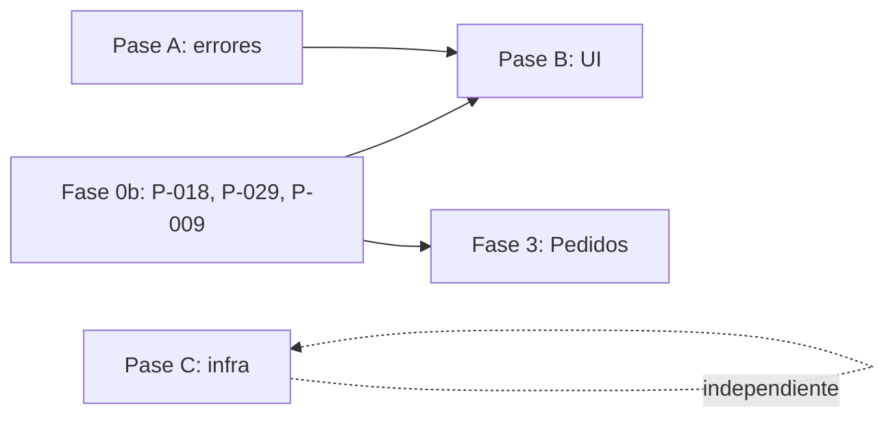

# Plan Fase 0c — Deuda P1 y P2

> [!danger] Leé primero [[Protocolo de Ejecución de un Plan]]
> Contrato completo: reglas de oro, orden de lectura y qué significa "terminado".

> [!abstract] Qué cierra
> Los ítems clasificados **P1** y **P2** el 2026-08-04. Continúa [[Plan Fase 0b - Cierre de la deuda P0]],
> que cubre P-018, P-029, P-009 y P-004.
>
> **P1:** P-015 · P-016+P-019+P-001 · P-025
> **P2:** P-028 · P-008 · P-017+P-011 · P-024 · P-010

> [!warning] Este plan NO se ejecuta entero de una vez
> Son ~5 días de trabajo que tocan casi todos los archivos de `ui/`. Va en **tres pases
> independientes** (§1), cada uno con su rama y su commit. Mezclarlos produce conflictos que
> no se pueden revisar.

---

## 1. La decisión de secuencia: tres pases, no ocho ítems

Al medir el alcance real aparece algo que la lista de deuda no muestra: **varios ítems tocan
exactamente los mismos archivos**. Tratarlos por separado significa tocar los 28 layouts y las
22 clases de `ui/` tres veces, con tres tandas de conflictos.

### Medición del código (2026-08-04)

| Métrica | Valor |
|---|---|
| Llamadas a `findViewById` | **169**, en 22 archivos |
| Pantallas (Activities + Fragments + diálogos) | 4 + 7 + 6 = **17** |
| Layouts | **28** |
| IDs en `snake_case` | **197 de 198** |
| Archivos con `mensajeDeError()` duplicado | **4** remotos + `SupabaseAuthRepository` |
| Constantes de texto en `ui/` y `data/` | **~57** |

### Los tres pases

| Pase | Ítems | Qué toca | Días |
|---|---|---|---|
| **A — Errores** | P-016 · P-019 · P-001 | `domain/Result`, los 5 repositorios, los ViewModels | ~1,5 |
| **B — Gran pase de UI** | P-015 · P-011 · P-017 | Los 28 layouts, las 22 clases de `ui/`, la estructura de paquetes | ~3 |
| **C — Infraestructura** | P-028 · P-008 · P-024 · P-010 | `core/SupabaseClient`, `build.gradle.kts`, tests | ~1 |

**A y C son ortogonales a B** (no tocan layouts) y se pueden hacer en cualquier orden o en
paralelo. **B es el que hay que hacer de una sola vez.**

> [!success] Por qué P-011 y P-017 suben a acompañar a P-015
> Los clasifiqué P2 y **acá se ejecutan junto al P1**. No es un ascenso de importancia: es que
> comparten radio de impacto.
>
> **ViewBinding genera los nombres de campo a partir de los IDs.** `txt_correo` genera
> `binding.txtCorreo`. Si se convierten las 169 llamadas a `findViewById` ahora y se renombran
> los IDs después, hay que **tocar dos veces cada referencia**. Renombrando en el mismo pase,
> P-011 cuesta **cero extra**: el ID nuevo y la referencia nueva se escriben juntos.
>
> Y P-017 (feature-first) mueve los mismos archivos de paquete. Hacerlo en el mismo commit que
> ya los reescribe es un `git mv` más; hacerlo aparte es reabrir 22 archivos.
>
> [[Deuda Técnica - Pendientes]] ya había visto la mitad de esto — P-011 está marcado como
> "bloqueado por P-017". Lo que faltaba ver es que **P-015 es el que los vuelve gratis**.

---

## 2. PASE A — El cluster de errores (P-016 · P-019 · P-001)

### 2.1 El problema, que es uno solo con tres síntomas

```java
// domain/Result.java
private final String error;      // ← la raíz
```

Con el error como `String`:

1. **La UI no puede reaccionar según el tipo de fallo** (P-016). No sabe si ofrecer
   "Reintentar" (red), mandar al login (401) o marcar un campo (validación).
2. **El mensaje se arma en `data`** (P-019), que no debería decidir cómo se le habla al
   usuario — y termina hardcodeado: hay **~57 constantes de texto** en `ui/` y `data/`, contra
   la regla de oro #8.
3. **Cada repositorio copia el mismo manejo** (P-001): `mensajeDeError()` está duplicado en
   `MenuRemoto`, `MesaRemoto`, `ClienteRemoto` y `EmpleadoRemoto`, y `SupabaseAuthRepository`
   tiene su propia versión del mismo `try/catch`.

Los tres se arreglan cambiando **una** cosa: qué transporta `Result`.

### 2.2 `AppException` tipada

```
domain/error/
├── AppException.java          — sellada por convención: constructor privado + factories
├── TipoError.java             — SIN_CONEXION, TIMEOUT, NO_AUTORIZADO, PROHIBIDO,
│                                NO_ENCONTRADO, CONFLICTO, VALIDACION, SERVIDOR, DESCONOCIDO
└── (ui) MapeadorDeError.java  — TipoError → @StringRes
```

`AppException` lleva: `TipoError`, un **`detalleServidor` opcional** (el `{"message": …}` de
PostgREST, que ya viene escrito para el usuario) y el código HTTP.

`Result<T>` pasa a `Result<T, AppException>`… **no**. En Java sin genéricos de unión eso
ensucia todas las firmas. La forma correcta acá:

```java
public final class Result<T> {
    private final T value;
    private final AppException error;   // ← el único cambio de tipo
    …
    public AppException getError() { … }
}
```

**Cambio quirúrgico:** el campo cambia de tipo, las firmas no. Los call sites que hacen
`resultado.getError()` esperando un `String` son los que hay que tocar — y son exactamente los
que tienen que mostrar el texto, o sea los que hay que arreglar de todos modos.

> [!important] Los mensajes del servidor no se tiran
> La Fase 2c estableció un patrón que funciona: los `raise exception` de los RPC están escritos
> para el usuario final y PostgREST los devuelve en `{"message": …}`. `MapeadorDeError` los
> **prefiere** cuando existen, y cae al `@StringRes` genérico cuando no. Convertir todo a
> códigos perdería el mejor texto que tiene el sistema.

### 2.3 `BaseRemoto` — donde muere la duplicación

Los cuatro `XxxRemoto` comparten hoy: `bearer()`, `mensajeDeError()`, la clase interna
`MensajePostgrest`, y los tres `catch` (`IOException` → sin conexión, `SecurityException` →
sin permiso de red, y el chequeo de token nulo).

```java
public abstract class BaseRemoto {
    protected final Supplier<String> proveedorToken;

    /** Envuelve toda llamada: token, ejecución, clasificación del error. */
    protected <T> ResultadoRed<T> ejecutar(LlamadaConToken<T> llamada) { … }
}
```

`MenuRemoto`, `MesaRemoto`, `ClienteRemoto`, `EmpleadoRemoto` y el futuro `PedidoRemoto`
extienden y borran ~60 líneas cada uno. `SupabaseAuthRepository` también, aunque su caso es
distinto (orquesta 3 llamadas) y solo hereda el `catch`.

### 2.4 Entregables del pase A

| # | Entregable | Pruebas |
|---|---|---|
| **A1** | `domain/error/`: `AppException`, `TipoError` | ~8 |
| **A2** | `Result` transporta `AppException`; actualizar call sites | ~6 |
| **A3** | `BaseRemoto` + los 4 remotos migrados | ~12 |
| **A4** | `MapeadorDeError` en `ui/` + las ~57 constantes a `strings.xml` | ~10 |
| **A5** | ViewModels: el estado lleva `AppException`, la Activity resuelve el texto | ~8 |

**Criterio de cierre:** `grep -rn 'private static final String [A-Z_]* = "' ui/ data/` devuelve
**0** resultados que sean texto de usuario.

---

## 3. PASE B — El gran pase de UI (P-015 · P-011 · P-017)

> [!danger] Este pase es todo o nada
> Toca 28 layouts, 22 clases y la estructura de paquetes. **No se parte en commits chicos** —
> un estado intermedio no compila. Rama propia, revisión de una sola vez.

### 3.1 P-015 — single-Activity + Navigation + ViewBinding

Tres cosas que el estándar pide y que hoy no están.

**Navigation Component 2.9.8** (estable, 2026-04-22, verificada en la página de releases de
AndroidX). Artefactos `navigation-fragment` y `navigation-ui` — **no existe variante `-ktx`
separada**, el artefacto principal sirve para Java. Plugin `androidx.navigation.safeargs`
(el que genera **Java**; `safeargs.kotlin` es el otro).

> [!note] La objeción del peso de Kotlin ya no aplica
> El proyecto evitaba librerías Kotlin-first por el tamaño del APK. **Verificado el 2026-08-04
> sobre `debugRuntimeClasspath`: `kotlin-stdlib 2.2.10` ya está en el classpath de runtime**,
> con 47 referencias, traído por `activity`, `appcompat`, `core`, `annotation` y `lifecycle`.
> Toda AndroidX moderna es Kotlin.
>
> O sea que Navigation **no agrega** una dependencia de Kotlin: agrega su propio código sobre
> una que ya está. Esto además debilita el argumento que [[Librerias Java-Friendly vs Kotlin-Only]]
> usa contra Retrofit 3 (**P-007**) — hay que corregir esa nota (§6).

**Estructura resultante:**

```
MainActivity (única Activity con NavHostFragment)
└── nav_graph.xml
    ├── inicioFragment          (start destination)
    ├── pedidosFragment · menuFragment · mesasFragment
    ├── clientesFragment · empleadosFragment · reportesFragment
    ├── loginFragment           ← era LoginActivity
    ├── solicitarCodigoFragment ← era SolicitarCodigoActivity
    └── cambiarContraseniaFragment ← era CambiarContraseniaActivity
```

> [!warning] El login como destino, y el `LAUNCHER`
> Hoy `LoginActivity` es la `LAUNCHER` y `MainActivity` la post-login. Al unificar, la
> `LAUNCHER` pasa a ser `MainActivity` y el grafo decide el destino inicial según haya sesión
> —lo que **P-009 de la Fase 0b** deja resuelto.
>
> **Dependencia real:** este pase queda mejor **después** de P-009. Sin sesión persistida, el
> destino inicial siempre es el login y la unificación no se puede probar de verdad.

**ViewBinding** reemplaza las **169** llamadas a `findViewById`. Se activa con
`buildFeatures { viewBinding = true }`. En Fragments hay que anular el binding en
`onDestroyView()` — es la fuga clásica y va documentada en el patrón.

Los 6 diálogos (`HojaModal` y derivados) **no** entran al grafo: siguen siendo
`DialogFragment` invocados desde su Fragment. Meterlos como destinos de Navigation complica
sin beneficio.

### 3.2 P-011 — IDs a `camelCase`, gratis en este pase

**197 de 198 IDs** están en `snake_case`. Como ViewBinding deriva el nombre del campo del ID,
renombrar ahora cuesta cero: se escribe el ID nuevo y la referencia nueva en el mismo gesto.

```
txt_correo   → etCorreo        (binding.etCorreo)
btn_login    → btnLogin
lista_mesas  → rvMesas
```

Convención en [[Convenciones Java]]. **Los IDs de `menu/` también** (`nav_pedidos`,
`accion_editar`), que se referencian desde código.

### 3.3 P-017 — feature-first, decidido

La estructura es `layer-first` con **seis** features (`login`, `empleados`, `menu`, `mesas`,
`clientes`, y `pedidos` cuando llegue la Fase 3), muy por encima del umbral que fijaba
[[Propuesta de División de Arquitectura]].

**Decisión de este plan: migrar a feature-first, módulo Gradle único.**

```
com.example.proyectofinalrestaurante
├── core/                       ← se queda (infraestructura compartida)
├── comun/                      ← Result, AppException, Permisos, HojaModal…
└── feature/
    ├── login/{ui,domain,data}
    ├── menu/{ui,domain,data}
    ├── mesas/{ui,domain,data}
    ├── clientes/{ui,domain,data}
    ├── empleados/{ui,domain,data}
    └── pedidos/{ui,domain,data}
```

**Multi-módulo Gradle queda fuera.** [[Roadmap de Fases]] lo listaba como decisión "antes de
Fase 4, si el proyecto va a llegar a 5 features". Llegó a seis, pero multi-módulo trae
`api`/`implementation`, build lento en gama baja de CI y una configuración de Room repartida.
**Feature-first dentro de un módulo da el 80% del beneficio (cada feature autocontenida,
límites visibles) por el 20% del costo.** Se revisa si aparece un segundo consumidor (una app
de cocina aparte, por ejemplo).

> [!danger] La regla de oro no se relaja
> `feature/x/domain` **sigue sin poder** importar de `feature/x/data`. Cambiar la carpeta no
> cambia la dirección de la flecha. Lo que sí mejora: hoy hay que recordarla; con esta
> estructura la violación se ve a simple vista en el `import`.

Todo movimiento con **`git mv`** para preservar el historial — como se hizo con
`mipmap-anydpi-v26` al cerrar P-003.

### 3.4 Entregables del pase B

| # | Entregable | Pruebas |
|---|---|---|
| **B1** | `viewBinding = true`; Navigation + Safe Args en el catálogo y el build | — |
| **B2** | `nav_graph.xml` + `MainActivity` como única Activity con `NavHostFragment` | ~4 |
| **B3** | Las 3 Activities restantes convertidas a Fragments; navegación por acciones | ~6 |
| **B4** | Las 169 `findViewById` → ViewBinding, con los IDs renombrados en el mismo pase | — |
| **B5** | `git mv` a feature-first + `import`s | — |
| **B6** | Test de arquitectura: ningún `import` de `.data.` dentro de `.domain.` | ~2 |

**B6 es el que convierte P-017 en algo permanente.** Un test que recorre los `.java` y falla si
un archivo bajo `domain` importa de `data` — 30 líneas que impiden que la regla de oro se
erosione. Sin él, feature-first es solo carpetas nuevas.

---

## 4. PASE C — Infraestructura (P-028 · P-008 · P-024 · P-010)

### 4.1 P-028 — la capa HTTP

Cuatro problemas; se atacan **1 y 3**, que son contenidos y testeables:

1. **`buildRetrofit()` crea un `OkHttpClient` nuevo en cada una de sus 7 invocaciones.** Son 7
   `ConnectionPool` y 7 pools de hilos contra el mismo host. → **Un `OkHttpClient` singleton**,
   compartido por los 7 Retrofit.
2. Sin caché HTTP → **se posterga**: PostgREST no manda `Cache-Control` y las imágenes ni pasan
   por OkHttp. Sin medir antes, es trabajo ciego.
3. **Timeouts incompletos:** hay `connect` y `read` (15 s); faltan `write` y `callTimeout`.
   [[Presupuestos de Rendimiento en Gama Baja]] pide connect 15 / read 30 / write 30 /
   callTimeout 45. **Sin `callTimeout`, una subida lenta se cuelga indefinidamente.**
4. Una sola resolución de imagen → **se posterga**: las dos salidas son decisiones de fondo
   (una es función de plan pago).

> [!note] Interacción con la Fase 3 y con P-009
> El WebSocket usa su **propio** `OkHttpClient` con `pingInterval` — no comparte el singleton,
> a propósito: un cliente con `readTimeout` de 30 s mataría una conexión persistente ociosa.
> Y el refresh de token de P-009 va en el `Supplier<String>`, **no** en un `Authenticator`,
> justamente para no depender de arreglar esto primero.

### 4.2 P-008 — R8 sí, Baseline Profile bloqueado

**Se parte en dos, porque una mitad se puede y la otra no.**

**R8 + shrinkResources — se hace ahora.** El build ya usa el DSL nuevo de AGP 9:

```kotlin
buildTypes {
    release {
        optimization {
            enable = false      // ← pasa a true
        }
    }
}
```

Con AGP 9.3+ el *resource shrinking* se activa solo al habilitar `optimization`; el proyecto
está en **AGP 9.2.1**, así que hay que **verificar si `shrinkResources` sigue necesitando
declaración aparte** y ajustar. Requiere además reglas de ProGuard para lo que R8 no ve por
reflexión: **los DTOs de Gson** (se deserializan por reflexión → `@Keep` o regla), Room y
WorkManager traen las suyas.

**Verificación obligatoria:** un APK de release que **no** haya sido ejercitado es un APK que
no se sabe si funciona. Hay que instalarlo y recorrer login + los cinco módulos. R8 rompe en
runtime, no en compilación.

> [!danger] Baseline Profile: bloqueado por versiones (verificado 2026-08-04)
> `androidx.benchmark` / `androidx.baselineprofile` estable es **1.4.1** (2025-09-10). El
> soporte del DSL nuevo de AGP 9 llegó en **1.5.0-alpha01** — y 1.5.0 **sigue en alpha**
> (`1.5.0-alpha05` al 2026-08-04). La 1.4.1 recomienda AGP máximo `9.0.0-alpha01` y exigía
> `newDsl=false`; el proyecto está en **AGP 9.2.1**.
>
> Las opciones son: (a) adoptar un plugin **alpha** para el pipeline de release, o (b)
> **esperar a 1.5.0 estable**. Este plan elige **(b)** — la regla de vigencia del
> [[Estándar de Ingeniería Android]] pide versiones verificadas, y meter un alpha en el camino
> de release por una optimización de arranque no vale el riesgo.
>
> **Queda como P-008b**, con condición de desbloqueo explícita: *"cuando `androidx.benchmark`
> 1.5.0 llegue a estable"*. El generador **sí** se puede escribir en Java (`BaselineProfileRule`
> tiene ejemplo Java oficial, aunque el lambda exige `return Unit.INSTANCE`).

### 4.3 P-024 — `CompresorDeImagen` con pruebas

Desbloqueado desde la 2b: **Robolectric ya está**. Cubre lo que importa:

| # | Caso |
|---|---|
| E1 | `inSampleSize` deja el lado largo en ~1024 px (no 2048 ni 512) |
| E2 | Una foto con `ORIENTATION_ROTATE_90` sale derecha |
| E3 | Una foto con `ORIENTATION_ROTATE_180` / `270` |
| E4 | Una imagen sin EXIF no se rota |

Sigue **sin cubrir** que una foto de 12 MP real entre en los 2 MB del bucket: Robolectric
*emula* `BitmapFactory`, no lo ejecuta. Se documenta como límite conocido en el propio test.

### 4.4 P-010 — accesibilidad (tuya)

Se cierra con el mismo teléfono con el que se verifica **P-004** (Fase 0b §2):

| # | Qué | ✅ |
|---|---|---|
| 1 | TalkBack lee los campos con su etiqueta, no "campo de edición" | ☐ |
| 2 | El error del login se anuncia solo al aparecer | ☐ |
| 3 | Con fuente al 200 % nada se recorta ni se superpone | ☐ |
| 4 | Todo tocable ≥ 48×48 dp (chips y botones circulares incluidos) | ☐ |

### 4.5 Entregables del pase C

| # | Entregable | Pruebas |
|---|---|---|
| **C1** | `OkHttpClient` singleton + timeouts completos | ~6 |
| **C2** | R8 + shrinkResources + reglas de ProGuard + APK de release verificado a mano | ~2 |
| **C3** | `CompresorDeImagenTest` con Robolectric | ~6 |
| **C4** | P-008b registrado con su condición de desbloqueo | — |

---

## 5. Orden recomendado y dependencias



| Orden | Qué | Por qué |
|---|---|---|
| 1 | **Fase 0b** (P0) | P-009 es precondición real del pase B: sin sesión persistida no se puede probar el destino inicial del grafo |
| 2 | **Pase A** (errores) | Independiente. Cuanto antes, menos código nuevo copia el patrón viejo |
| 3 | **Pase C** (infra) | Independiente de todo. Se puede intercalar |
| 4 | **Pase B** (UI) | Último de los tres: es el más grande y el que más se beneficia de que A ya haya limpiado los mensajes |

> [!question] ¿Y la Fase 3?
> **El pase B compite con la Fase 3 por los mismos archivos de `ui/`.** Hay que elegir:
>
> - **B antes que Fase 3** → Pedidos nace en la estructura final. Retrasa la funcionalidad
>   ~3 días pero no se escribe nada dos veces.
> - **Fase 3 antes que B** → la funcionalidad sale antes, y el pase B después convierte
>   **un Fragment y una hoja modal más**. Costo extra real: bajo.
>
> **Recomendación: Fase 3 primero.** El pase B crece linealmente con la cantidad de pantallas
> (+2 sobre 17 es ~12% más), mientras que retrasar el tiempo real retrasa lo único que el
> usuario pidió. La ventana de P-015 se está cerrando, pero no se cierra por dos pantallas.

---

## 6. Correcciones a la bóveda

| Nota | Corrección |
|---|---|
| [[Librerias Java-Friendly vs Kotlin-Only]] | El argumento *"Retrofit 3 arrastra una dependencia transitiva de Kotlin… suma peso al APK"* (P-007) **ya no aplica**: `kotlin-stdlib 2.2.10` está en el runtime classpath por AndroidX. Verificado el 2026-08-04 |
| [[Deuda Técnica - Pendientes]] | P-008 se parte en **P-008a** (R8, se hace) y **P-008b** (Baseline Profile, bloqueado por versión). P-011/P-017 pasan a "se ejecutan con P-015" |
| [[Propuesta de División de Arquitectura]] | Registrar la decisión de §3.3: feature-first en módulo único, multi-módulo descartado con su razón |
| [[Arquitectura Actual]] | Tras el pase B: la tabla de paquetes cambia entera |

Un **ADR-009 — Feature-first en módulo único** sale de §3.3: tiene alternativa razonable
(multi-módulo), trade-offs y consecuencias. Lo escribe quien ejecute el pase B.

Y dos patrones nuevos para `20 - Patrones`: **"ViewBinding en Fragments sin fugas"** (el
`onDestroyView`) y **"Error tipado con AppException"**.

---

## 7. Resumen de esfuerzo

| Pase | Ítems | Entregables | Tests nuevos | Días |
|---|---|---|---|---|
| A | P-016 · P-019 · P-001 | A1–A5 | ~44 | ~1,5 |
| B | P-015 · P-011 · P-017 | B1–B6 | ~12 | ~3 |
| C | P-028 · P-008a · P-024 (+ P-010 tuyo) | C1–C4 | ~14 | ~1 |

Suite: **345 → ≥ 415**. Cada pase cierra con
`./gradlew testDebugUnitTest assembleDebug` en BUILD SUCCESSFUL y el
[[Gate de Autoverificación]] impreso.

## 8. Lo que este plan NO hace

- **No adopta Hilt** (**P-002**). El pase B reordena paquetes; meter DI en el mismo movimiento
  duplica el riesgo. Después de B, con features autocontenidas, Hilt es más fácil — no menos.
- **No decide P-007** (Retrofit 3). Solo corrige el argumento con el que se estaba decidiendo.
- **No hace multi-módulo Gradle** (§3.3).
- **No agrega caché HTTP ni thumbnails** (P-028 puntos 2 y 4): sin medir antes es trabajo ciego.
- **No cifra Room** (**P-027**) ni limpia el bucket (**P-023**).

---

## Relaciones

- [[Deuda Técnica - Pendientes]] — los ocho ítems
- [[Plan Fase 0b - Cierre de la deuda P0]] — va antes; P-009 es precondición del pase B
- [[Plan Fase 3 - Pedidos en Tiempo Real]] — compite con el pase B por los archivos de `ui/`
- [[Estándar de Ingeniería Android]] — de donde salen P-015 y P-017
- [[Propuesta de División de Arquitectura]] · [[Modularizacion por Feature]] — el umbral que se pasó
- [[Librerias Java-Friendly vs Kotlin-Only]] — se corrige acá
- [[Convenciones Java]] — la convención de IDs de P-011
- [[Presupuestos de Rendimiento en Gama Baja]] — los timeouts de P-028
- [[Result Pattern]] · [[Base Repository con manejo de errores]] — lo que el pase A implementa
- [[Estrategia de Pruebas Android]] · [[Accesibilidad Android]] · [[Gate de Autoverificación]]
