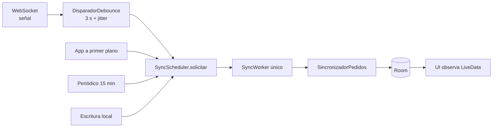

# Plan Fase 3 — Pedidos en Tiempo Real

> [!success] Parte A cerrada y verificada — 2026-08-05
> Las 4 migraciones (`fase3_pedidos_estado_pedido_y_columnas`,
> `..._vista_y_rpc_avanzar_estado`, `..._realtime_broadcast`, `..._rls_consolidada_y_no_borrar`)
> están aplicadas. DDL real documentado en [[Esquema de Base de Datos]]. De las 12 pruebas
> de aceptación de §2.9: **11 verificadas** en vivo con transacciones `BEGIN…ROLLBACK`
> (sin tocar datos reales); **A10** (que el `INSERT` dispare el broadcast) queda pendiente
> del Realtime Inspector del dashboard — no verificable por SQL ni por ningún agente.
> `get_advisors(security)` → 0 hallazgos nivel `ERROR`.
>
> **Parte B (Android) sigue pendiente** — no se tocó código de la app en este pase.

> [!danger] Leé primero [[Protocolo de Ejecución de un Plan]]
> Ahí está el contrato completo: la división Parte A / Parte B, el orden de lectura, las
> reglas de oro del código y qué significa "terminado". **No es opcional.**

> [!warning] Depende de 2b, 2c y 2d — y se apoya en ellas, no las repite
> Pedidos **no trae infraestructura nueva de sincronización**. Nace sobre la que ya existe
> ([[Plan Fase 2b - Offline-First con Room y Outbox]]): Room como única fuente de verdad,
> outbox particionado, `SyncWorker` único, sync delta con marca de agua. Lo único que agrega
> es un **disparador más rápido** para esa misma máquina. Ver §4.1 — es la decisión central
> del plan.

> [!info] Renumeración
> Este plan ocupa la **Fase 3**, que [[Roadmap de Fases]] tenía reservada sin contenido. La
> antigua "Fase 4 — Pedidos" queda absorbida acá; la toma del pedido (carrito, detalle,
> complementos) se difiere a una **Fase 3b** por el alcance acordado con el usuario, no por
> omisión. Ver §1.2.

---

## 1. El encargo, reformulado

### 1.1 Especificación de requisitos

Lo que se pidió, reescrito como requisitos verificables:

| # | Requisito | Tipo | Criterio de aceptación |
|---|---|---|---|
| R1 | Los pedidos que entran aparecen en los demás dispositivos **sin que nadie refresque** | Funcional | Un pedido creado en el dispositivo A se ve en B en **< 5 s** con la app en primer plano |
| R2 | Un **buzón de notificaciones** en el menú ⋮ de la barra superior, con contador de no leídas | Funcional | El ⋮ muestra badge; al abrirlo se listan las notificaciones y se marcan leídas |
| R3 | El selector **"Ver como otro rol"** desaparece del ⋮ | Funcional | `SelectorRolDebug`, `menu_debug.xml` y sus strings ya no existen en el repo |
| R4 | La integración soporta **≥ 25 dispositivos concurrentes** sin degradar la base | No funcional | §5.1 — presupuesto numérico y su margen |
| R5 | Una ráfaga de cambios se colapsa en **una sola** sincronización (ventana de 3 s) | No funcional | Test: 25 señales en 500 ms producen ≤ 2 llamadas a `SyncScheduler.solicitar` |
| R6 | La lista **no carga todos los pedidos de golpe**; crece al deslizar | No funcional | Primera pintura ≤ 20 filas; al llegar al final se agregan 20 más |
| R7 | Orden **FIFO** — el que entró primero se atiende primero | Funcional | `ORDER BY fecha ASC, id_pedido ASC`, con índice que lo respalde |
| R8 | **Cero duplicación** de la lógica de sincronización ya existente | Arquitectura | §4.1 — el canal no escribe en Room; solo dispara el sincronizador que ya hay |

### 1.2 Alcance — lo que entra y lo que no

**Entra (Fase 3):** el tablero de pedidos en tiempo real. Ver, filtrar por estado, paginar
FIFO, avanzar el estado según el rol, y el buzón de notificaciones.

**No entra (Fase 3b):** la **toma** del pedido — carrito, elección de platillos y
complementos, cantidades, asignación de mesa y cliente. Es escritura multi-tabla
(`pedido` + `detalle_pedido` + `detalle_complemento`) en una sola operación de outbox, y
arrastra dos deudas abiertas que hay que resolver primero: **P-026** (id de cliente offline)
y **P-025** (`now()` en el sync delta, que recién muerde con transacciones multi-sentencia —
exactamente las que crea un alta de pedido con su detalle).

Decidido así a propósito: entrega antes algo demostrable y ataca el requisito que motiva la
fase, en vez de mezclar dos problemas grandes en una rama.

### 1.3 Historias

| # | Historia | Rol |
|---|---|---|
| 1 | Ver el tablero de pedidos con su número, referencia, hora, total y estado | admin, mesero, cocina |
| 2 | Que un pedido nuevo aparezca solo, sin refrescar | los tres |
| 3 | Avanzar el estado de un pedido (Pendiente → En preparación → Listo) | admin, **cocina** |
| 4 | Marcar un pedido como Entregado | admin, **mesero** |
| 5 | Cancelar un pedido | solo admin |
| 6 | Filtrar por estado | los tres |
| 7 | Ver el buzón de notificaciones y su contador | los tres |
| 8 | Recibir aviso de "pedido nuevo" | admin, cocina |
| 9 | Recibir aviso de "tu pedido está listo" | el mesero que lo tomó |
| 10 | Ver en el buzón los cambios propios que no pudieron subir | los tres |

La matriz de 3 a 5 **ya está** en `domain/Permisos`: `CAMBIAR_ESTADO` la tienen admin y
cocina; mesero tiene `CREAR`/`EDITAR`; `ELIMINAR` (que en Pedidos se llama "Cancelar") solo
admin. No se toca `Permisos`; se consume.

`ui/pedidos/` hoy es maqueta y lee de `DatosMaqueta`. Al terminar, `DatosMaqueta.Pedido`,
`LineaPedido`, `EstadoPedido` y `pedidos()` **desaparecen** — mismo camino que `Empleado` en
la 1d, `Platillo`/`Categoria` en la 2a y `Mesa` en la 2c.

---

## 2. PARTE A — Servidor (solo con acceso a Supabase)

> [!danger] Paso 0 obligatorio
> [[Esquema de Base de Datos]] documenta `pedido` en el diagrama pero **nunca registró su
> DDL real**, igual que pasó con `mesa` y `clientes` antes de la 2c/2d. Antes de escribir una
> migración: listá columnas, tipos, constraints y policies reales de `public.pedido`,
> `public.detalle_pedido` y `public.tipo_pedido`, **escribilas en [[Esquema de Base de Datos]]**
> y recién ahí adaptá lo que sigue. Si algo existe con otro nombre, **gana lo que hay en la
> base**: se corrige el plan, no la base.

**Estado verificado el 2026-08-04** (vía `list_tables`): `pedido` tiene
`id_pedido, fecha timestamp, id_estado, id_cliente, id_mesa, id_usuario, id_tipo_pedido`.
**No tiene** `actualizado_en` ni estado operativo propio. `tipo_pedido` tiene 2 filas;
`pedido`, `detalle_pedido` y `detalle_complemento` están **vacías** — todo lo de esta sección
se aplica sin migrar datos.

### 2.1 `estado_pedido`: catálogo propio, no `estado_general`

Es exactamente el caso que [[ADR-007 - Estados operativos en catálogos propios, separados de estado_general]]
dejó anticipado (*"`pedido` va a necesitar el mismo tratamiento"*). Dos conceptos ortogonales:

| Concepto | Columna | Valores | Quién lo cambia |
|---|---|---|---|
| ¿El pedido existe? | `id_estado` → `estado_general` | Activo / Inactivo | Solo admin |
| ¿En qué punto del flujo está? | `id_estado_pedido` → `estado_pedido` | Pendiente / En preparación / Listo / Entregado / Cancelado | Según rol, vía RPC |

```sql
create table if not exists public.estado_pedido (
    id_estado_pedido int generated always as identity primary key,
    descripcion      varchar(50) not null,
    orden            int not null,
    constraint uq_estado_pedido_descripcion unique (descripcion)
);

insert into public.estado_pedido (descripcion, orden)
select v, o from (values
    ('Pendiente', 1), ('En preparación', 2), ('Listo', 3),
    ('Entregado', 4), ('Cancelado', 99)) as t(v, o)
where not exists (select 1 from public.estado_pedido where descripcion = t.v);
```

Los cinco valores y su orden son los mismos que ya usa `DatosMaqueta.EstadoPedido` — la
maqueta se construyó con este flujo y se respeta.

### 2.2 Columnas y índices sobre `pedido`

```sql
alter table public.pedido
    add column if not exists id_estado_pedido int not null default 1
        references public.estado_pedido(id_estado_pedido),
    add column if not exists actualizado_en timestamptz not null default now();

-- pedido.fecha es TIMESTAMP sin zona: un pedido de las 19:00 en Honduras se lee distinto
-- según el cliente. [[Esquema de Base de Datos]] lo dejó anotado como pendiente; la tabla
-- está vacía, así que el momento de arreglarlo es ahora y es gratis.
alter table public.pedido
    alter column fecha type timestamptz using fecha at time zone 'America/Tegucigalpa',
    alter column fecha set default now();

drop trigger if exists trg_pedido_actualizado_en on public.pedido;
create trigger trg_pedido_actualizado_en
    before update on public.pedido
    for each row execute function public.tocar_actualizado_en();

-- El delta ordena y filtra por (actualizado_en, id_pedido): sin este índice el sync hace
-- seq scan de la tabla más grande del sistema en cada pasada de cada dispositivo.
create index if not exists ix_pedido_actualizado_en
    on public.pedido (actualizado_en, id_pedido);

-- FIFO (R7): el tablero ordena por hora de ingreso.
create index if not exists ix_pedido_fecha
    on public.pedido (fecha, id_pedido);
```

`tocar_actualizado_en()` ya existe desde la Parte A de la 2c/2d — se reutiliza, no se
duplica. Ojo con **P-025**: usa `now()`, que es la hora de **inicio** de la transacción.
Sigue siendo aceptable en esta fase porque el único `UPDATE` es el RPC de una sentencia; deja
de serlo en la 3b (alta con detalle). Registrado como precondición de esa fase.

### 2.3 Sembrar `tipo_pedido`

`pedido.id_tipo_pedido` es `NOT NULL` con FK. `tipo_pedido` tiene 2 filas cargadas —
**verificá cuáles son antes de asumir**. Si no cubren "En mesa" y "Para llevar" (los dos
que la maqueta muestra como `referencia`), completalo con el mismo `insert … where not exists`
del §2.1.

### 2.4 `vista_pedidos` — el contrato de lectura

```sql
create or replace view public.vista_pedidos
with (security_invoker = on) as
select  p.id_pedido,
        p.fecha,
        p.id_estado_pedido,
        ep.descripcion              as estado_pedido,
        p.id_estado,
        p.id_mesa,
        m.numero_mesa,
        p.id_cliente,
        trim(coalesce(c.nombres, '') || ' ' || coalesce(c.apellidos, '')) as cliente,
        p.id_tipo_pedido,
        tp.descripcion              as tipo_pedido,
        p.id_usuario,
        u.id_auth_user              as id_auth_usuario,
        coalesce(sum(dp.cantidad * dp.precio), 0)::numeric(10,2) as total,
        coalesce(sum(dp.cantidad), 0)::int                       as cantidad_items,
        p.actualizado_en
from        public.pedido         p
join        public.estado_pedido  ep on ep.id_estado_pedido = p.id_estado_pedido
join        public.tipo_pedido    tp on tp.id_tipo_pedido   = p.id_tipo_pedido
join        public.usuarios       u  on u.id_usuario        = p.id_usuario
left join   public.mesa           m  on m.id_mesa           = p.id_mesa
left join   public.clientes       c  on c.id_cliente        = p.id_cliente
left join   public.detalle_pedido dp on dp.id_pedido        = p.id_pedido
group by p.id_pedido, ep.descripcion, m.numero_mesa, c.nombres, c.apellidos,
         tp.descripcion, u.id_auth_user;
```

> [!important] Por qué la vista expone `id_auth_usuario`
> La historia 9 ("tu pedido está listo") necesita saber si el pedido lo tomó **este**
> dispositivo. `Sesion.getIdUsuario()` guarda el `uuid` de `auth.users`, pero
> `pedido.id_usuario` es el `int` de `public.usuarios`. Sin esta columna el cliente tendría
> que resolver el mapeo con una consulta extra en cada arranque. Exponerla en la vista lo
> vuelve una comparación de strings en memoria — cero viajes de red.
>
> No filtra nada sensible: es el id de un empleado, ya visible para cualquier sesión activa
> a través de `vista_empleados`.

El `total` calculado en la vista es deliberado: el tablero lo muestra en cada tarjeta y
recalcularlo en el cliente exigiría bajar `detalle_pedido` completo — justo lo que R6 quiere
evitar. En la 3b, cuando el detalle se baje de todos modos, se revisa.

### 2.5 RPC `avanzar_estado_pedido` — la única vía de escritura del estado

RLS autoriza **filas**, no columnas ni transiciones. Mismo razonamiento que llevó a
`cambiar_estado_mesa` en la 2c: sin RPC habría que darle `UPDATE` sobre `pedido` a cocina, y
con eso podría cambiar la mesa, el cliente o el total.

```sql
create or replace function public.avanzar_estado_pedido(
    p_id_pedido int, p_id_estado_pedido int)
returns void
language plpgsql
security definer
set search_path = ''
as $$
declare
    v_rol    text := public.rol_actual();
    v_actual int;
begin
    if v_rol is null then
        raise exception 'Tu sesión no está activa.';
    end if;

    select id_estado_pedido into v_actual
    from public.pedido where id_pedido = p_id_pedido and id_estado = 1;

    if v_actual is null then
        raise exception 'Ese pedido no existe o está dado de baja.';
    end if;
    if v_actual in (4, 5) then
        raise exception 'Ese pedido ya está cerrado.';
    end if;

    -- La misma matriz que domain/ReglasPedido evalúa en el cliente. Acá es la que manda.
    if not (
        (v_rol = 'admin')
     or (v_rol = 'cocina' and p_id_estado_pedido in (2, 3) and p_id_estado_pedido = v_actual + 1)
     or (v_rol = 'mesero' and p_id_estado_pedido = 4 and v_actual = 3)
    ) then
        raise exception 'Tu rol no puede llevar el pedido a ese estado.';
    end if;

    update public.pedido
       set id_estado_pedido = p_id_estado_pedido
     where id_pedido = p_id_pedido;
end;
$$;

revoke execute on function public.avanzar_estado_pedido(int, int) from public, anon;
grant  execute on function public.avanzar_estado_pedido(int, int) to authenticated;
```

Los mensajes de `raise exception` están escritos **para el usuario final**: `MesaRemoto` ya
demostró que PostgREST los devuelve en `{"message": …}` y que el cliente los muestra tal cual.

### 2.6 El disparador de tiempo real — señal, no dato

> [!success] Esta es la pieza que decide si R4 se cumple o no
> Ver [[ADR-008 - Tiempo real como señal, por Broadcast desde la base]] para el razonamiento
> completo y las alternativas descartadas. Resumen: el mensaje que viaja **no lleva la fila**.
> Lleva un `{"t":"pedido"}` de 14 bytes que significa "hay novedades en Pedidos".

```sql
create or replace function public.avisar_cambio_pedidos()
returns trigger
language plpgsql
security definer
set search_path = ''
as $$
begin
    -- Payload sin datos de la fila: el canal es un timbre, no un caño de datos.
    -- Quien lo recibe pide su delta por PostgREST, donde la RLS ya decide qué puede ver.
    perform realtime.send('{"t":"pedido"}'::jsonb, 'cambio', 'pedidos', true);
    return null;
end;
$$;

revoke execute on function public.avisar_cambio_pedidos() from public, anon, authenticated;

drop trigger if exists trg_pedido_avisar_cambio on public.pedido;
create trigger trg_pedido_avisar_cambio
    after insert or update or delete on public.pedido
    for each statement execute function public.avisar_cambio_pedidos();
```

Tres detalles que no son decorativos:

1. **`FOR EACH STATEMENT`, no `FOR EACH ROW`.** Un `INSERT` de 20 pedidos emite **un**
   mensaje, no 20. Como el payload no lleva la fila, no se pierde nada. Es la primera de las
   dos defensas contra la ráfaga; la segunda es el debounce del cliente (§4.3).
2. **`revoke execute … from public`** también a `authenticated`. Toda función creada en
   `public` queda expuesta como RPC por PostgREST, y Postgres le da `EXECUTE` a `PUBLIC` por
   defecto. Es la regla 5 del [[Protocolo de Ejecución de un Plan]], que salió de un hallazgo
   real de `get_advisors`.
3. **`pedido` NO se agrega a la publicación `supabase_realtime`.** Verificado el 2026-08-04:
   la publicación existe y está vacía. Debe seguir así — agregarla activaría *Postgres
   Changes*, que es justo el mecanismo que este diseño evita (§5.1).

### 2.7 Autorización del canal privado

El canal es `private: true`, así que Realtime evalúa una policy sobre `realtime.messages`
—una tabla que no guarda nada: Realtime corre la consulta y la revierte— usando
`realtime.topic()` para saber a qué tema se quiere entrar.

```sql
create policy "staff activo puede escuchar el canal de pedidos"
on realtime.messages
for select to authenticated
using (
    (select realtime.topic()) = 'pedidos'
    and realtime.messages.extension = 'broadcast'
    and public.rol_actual() is not null
);
```

Se apoya en `rol_actual()`, que ya exige `perfiles.activo = true`: **un empleado desactivado
no puede ni escuchar el canal**, sin escribir una sola regla nueva. No se crea policy de
`INSERT`: ningún cliente publica en este canal, solo el trigger.

### 2.8 RLS sobre `pedido` y `detalle_pedido`

Mismo molde que Mesas y Clientes, todo sobre `rol_actual()`:

| Tabla | Acción | Quién |
|---|---|---|
| `pedido` | `SELECT` | `rol_actual() is not null` (los tres roles) |
| `pedido` | `INSERT` | admin, mesero |
| `pedido` | `UPDATE` | **nadie directamente** — solo el RPC del §2.5 |
| `pedido` | `DELETE` | nadie (trigger `trg_pedido_no_borrar`) |
| `detalle_pedido` | `SELECT` | los tres |
| `detalle_pedido` | `INSERT`/`UPDATE` | admin, mesero |

> [!warning] Una policy por rol y acción, no dos
> `get_advisors(performance)` ya reporta **19 avisos `multiple_permissive_policies`** en las
> tablas existentes, porque el patrón usado fue "una policy de lectura para staff" + "una de
> escritura para admin", y ambas aplican a `SELECT`. Cada policy extra se evalúa por fila.
> En `pedido` —la tabla que más va a crecer— eso importa. **Escribí una sola policy por
> (rol, acción)**, con la condición completa adentro.

### 2.9 Pruebas de aceptación de la Parte A

Cada una dentro de `BEGIN … ROLLBACK`, simulando el rol con los usuarios reales de `perfiles`:

| # | Caso | Esperado | Verificado |
|---|---|---|---|
| A1 | `avanzar_estado_pedido(p, 2)` como **cocina** sobre un pedido Pendiente | OK, queda En preparación | ✅ 2026-08-05 |
| A2 | `avanzar_estado_pedido(p, 4)` como **cocina** | Excepción "Tu rol no puede…" | ✅ 2026-08-05 |
| A3 | `avanzar_estado_pedido(p, 4)` como **mesero** sobre un pedido Listo | OK | ✅ 2026-08-05 |
| A4 | `avanzar_estado_pedido(p, 3)` como **mesero** | Excepción | ✅ 2026-08-05 (2 variantes: pedido Pendiente y pedido Cancelado) |
| A5 | `avanzar_estado_pedido(p, 5)` como **admin** | OK, Cancelado | ✅ 2026-08-05 |
| A6 | `avanzar_estado_pedido` sobre un pedido ya Entregado | Excepción "ya está cerrado" | ✅ 2026-08-05 |
| A7 | `UPDATE public.pedido SET total…` directo como cocina | 0 filas (sin policy de UPDATE) | ✅ 2026-08-05 |
| A8 | `SELECT * FROM vista_pedidos` como los tres roles | Devuelve filas en los tres | ✅ 2026-08-05 |
| A9 | `SELECT` sobre `vista_pedidos` con un perfil `activo = false` | 0 filas | ✅ 2026-08-05 |
| A10 | `INSERT` en `pedido` → ¿el trigger emitió el broadcast? | Verificable con el Realtime Inspector del dashboard | ⬜ Pendiente — requiere el dashboard, no verificable por SQL ni por un agente |
| A11 | `execute` de `avisar_cambio_pedidos()` como `authenticated` | Permiso denegado | ✅ 2026-08-05 |
| A12 | `get_advisors(security)` al terminar | **0 errores** | ✅ 2026-08-05 — 0 nivel `ERROR` (solo `WARN` preexistentes en todo el esquema) |

Detalle de la corrida y el DDL real verificado en [[Esquema de Base de Datos]].

---

## 3. El contrato que consume el cliente

### 3.1 HTTP (PostgREST) — sin novedades de infraestructura

| Operación | Método y ruta |
|---|---|
| Delta de pedidos | `GET /rest/v1/vista_pedidos?select=*&actualizado_en=gt.{marca}&order=actualizado_en.asc,id_pedido.asc&limit=50&offset={n}` |
| Catálogo de estados | `GET /rest/v1/estado_pedido?select=*&order=orden.asc` |
| Avanzar estado | `POST /rest/v1/rpc/avanzar_estado_pedido` con `{"p_id_pedido":…,"p_id_estado_pedido":…}` |

### 3.2 WebSocket (Realtime)

```
wss://<PROJECT_REF>.supabase.co/realtime/v1/websocket?apikey=<PUBLISHABLE_KEY>&vsn=1.0.0
```

Detalle del protocolo (envoltorio, `phx_join`, heartbeat, `access_token`, errores) en
[[Supabase Realtime sin SDK - WebSocket crudo y Broadcast desde la base]]. Lo mínimo:

```json
{ "topic": "realtime:pedidos", "event": "phx_join", "ref": "1", "join_ref": "1",
  "payload": { "config": { "private": true, "broadcast": { "self": false } } },
  "access_token": "<JWT de la sesión>" }
```

Y cada 25 s, sobre el tópico `phoenix`:

```json
{ "topic": "phoenix", "event": "heartbeat", "ref": "7", "payload": {} }
```

---

## 4. PARTE B — Arquitectura Android

### 4.1 La decisión central: el canal dispara, no escribe

> [!success] Respuesta a R8 — dónde se reutiliza en vez de duplicar
> **El punto de reutilización es `SyncScheduler.solicitar()`.** Todo lo nuevo se enchufa
> *encima* de él; nada se enchufa *al lado*.



El canal de tiempo real es **un cuarto disparador** de la misma cadena que ya existe. Si el
WebSocket llegara con la fila adentro, harían falta un segundo camino de escritura a Room, un
segundo resolvedor de conflictos, un segundo mapper y un segundo lugar donde equivocarse con
la marca de agua — es decir, una copia de `SincronizadorPedidos` que se desincroniza el día
que alguien toque uno de los dos. Con la señal, **`data/realtime` no conoce ni una clase del
dominio de Pedidos**: sabe decir "hay novedades en el módulo X" y nada más.

Tres consecuencias que se ganan gratis:

1. **Room sigue siendo la única fuente de verdad** (regla 1 de
   [[Offline-First con Room y Outbox]]). El socket no la contradice, la apura.
2. **Degradación limpia.** Sin socket —red mala, app en segundo plano, plan agotado— el
   periódico de 15 minutos y el sync-on-launch siguen funcionando. No hay "modo tiempo real"
   y "modo normal": hay una sola máquina con un timbre opcional.
3. **La RLS se sigue evaluando en el `GET`**, donde ya está probada. El canal nunca transporta
   datos que puedan filtrarse a un rol que no debía verlos.

### 4.2 El canal (`data/realtime`)

| Clase | Rol | Depende de Android |
|---|---|---|
| `CanalTiempoReal` (interfaz) | `conectar(token)` · `desconectar()` · `observarSenales(oyente)` | no |
| `CanalRealtimeSupabase` | Implementación con `okhttp3.WebSocket` + Phoenix v1.0.0 | solo OkHttp |
| `SenalDeCambio` | El módulo que cambió (`"PEDIDOS"`). Inmutable | no |
| `DisparadorDebounce` | Colapsa la ráfaga y llama al `Runnable` que le inyecten | **no** — Java puro |
| `SupervisorTiempoReal` (en `core`) | Conecta/desconecta según `ProcessLifecycleOwner` | sí |

> [!info] Cero dependencias nuevas
> **OkHttp ya está en el classpath**: `com.squareup.retrofit2:retrofit:2.11.0` arrastra
> `com.squareup.okhttp3:okhttp:3.14.9` (verificado en la caché de Gradle el 2026-08-04).
> OkHttp trae `WebSocket`/`WebSocketListener` desde 3.5 y es **Java puro**, sin
> `kotlin-stdlib`. No hace falta el SDK de Supabase —lo que además contradiría
> [[ADR-002 - Supabase Auth via REST directo (Retrofit) en vez del SDK Kotlin]]— ni subir
> OkHttp a 4.x, que sí arrastraría Kotlin y pesaría contra
> [[Presupuestos de Rendimiento en Gama Baja]].
>
> **E0 del plan:** confirmar en el build real que `okhttp3.WebSocket` resuelve. Si no, la
> salida es declarar `okhttp` 3.14.9 explícito en el catálogo (misma versión ya resuelta,
> cero cambio de comportamiento), **no** saltar a 4.x.

**Un socket por proceso, no uno por pantalla.** Es el hermano de la regla del `SyncWorker`
único: si cada Fragment abriera el suyo, navegar entre módulos sería abrir y cerrar sockets, y
25 dispositivos × 5 pantallas rompería la cuota de conexiones. Vive en `SyncApplication`,
junto al `ProcessLifecycleOwner` que ya está ahí.

**Ciclo de vida:**

| Evento | Acción |
|---|---|
| `onStart` del proceso **y** hay sesión | Conectar |
| `onStop` del proceso | Desconectar limpio (`phx_leave` + `close(1000)`) |
| Reconexión exitosa | **Forzar una sincronización** — pudieron perderse señales mientras estaba caído |
| `phx_error` / cierre inesperado | Backoff `[1s, 2s, 5s, 10s, 30s]` con jitter, tope 30 s |
| JWT vencido (`InvalidJWTExpiration`) | **No reintentar en bucle.** Desconectar y quedarse en el disparador periódico |

Ese último renglón es la interacción con **P-009** (el token no se refresca). Sin resolver
P-009, la sesión vence y el canal no puede recuperarse solo. Un reintento ciego ahí sería un
bucle de conexiones fallidas quemando batería. Se documenta como límite conocido, no se
esconde.

Nunca socket en segundo plano: Android lo mataría igual y el periódico ya cubre ese caso.

### 4.3 El debounce (R5) — y por qué es *leading + trailing*

El pedido fue "un debounce de 3 segundos para recibir las 25 peticiones en una sola". La
implementación literal —esperar 3 s de silencio y recién ahí sincronizar— cumple el
requisito pero **le suma 3 segundos a todos los pedidos**, incluido el caso normal de un
pedido solo. Sería pagar el peor caso siempre.

Lo que se implementa, y por qué es mejor sin dejar de cumplir R5:

```
señal 1  → sincroniza YA           (latencia sub-segundo en el caso común)
señales 2..25 dentro de 3 s → se tragan
al cerrar la ventana, si hubo alguna → sincroniza UNA vez más   (nada se pierde)
```

Es un *throttle con borde de salida*. Con 25 señales en 500 ms produce **2** sincronizaciones,
no 25 — cumple R5 (≤ 2) con latencia de una y garantía de la otra.

> [!question] ¿No alcanzaba con `ExistingWorkPolicy.KEEP`?
> No, y vale entender por qué. `KEEP` ya descarta los pedidos que llegan con un worker vivo,
> así que *parece* un colapsador. Pero es **con pérdida**: si la señal 25 llega justo después
> de que el worker leyó su última página, ese cambio espera al próximo disparador — hasta 15
> minutos. El borde de salida del debounce existe exactamente para eso: **garantizar una
> pasada después de que la ráfaga se calma.**

**El jitter es la pieza que el enunciado no pedía y hace falta igual.** Sin él, los 25
dispositivos reciben el mismo broadcast en el mismo milisegundo y disparan 25 `GET` idénticos
contra PostgREST a la vez: se cambia un cuello de botella por otro. Cada dispositivo suma un
retardo aleatorio de **0–1500 ms** antes de la pasada de cierre, y las 25 consultas se
reparten en vez de apilarse.

`DisparadorDebounce` es **Java puro** con el reloj y el `ScheduledExecutorService` inyectados
por constructor. Sin eso no se puede testear R5 sin dormir 3 segundos reales en la suite.

### 4.4 Sincronizador y persistencia

`SincronizadorPedidos implements Sincronizador` — se suma a la lista del `SyncWorker` en
`SyncApplication.FactoryDeSync`, exactamente como se sumaron Mesas y Clientes. Una línea.

> [!danger] Copiá `SincronizadorMenu`, **nunca** `SincronizadorMesas`
> Verificado el 2026-08-04 en el código: de los cuatro sincronizadores, **solo
> `SincronizadorMenu` tiene el delta corregido** (marca fija durante la pasada, `offset` que
> avanza, tope `MAX_PAGINAS`, y cada página aplicada en una transacción). `SincronizadorMesas`,
> `SincronizadorClientes` y `SincronizadorEmpleados` todavía avanzan la marca **dentro** del
> bucle y no usan `offset` — el bug que [[Offline-First con Room y Outbox]] documenta como
> *"paginar el delta por marca de agua pierde filas"*.
>
> En Pedidos ese bug **se manifiesta sí o sí**: una tanda de pedidos del mediodía comparte
> `actualizado_en` con precisión de milisegundos, y con más de 50 filas iguales las
> excedentes no se bajan **nunca**. Registrado como **P-029** para las otras tres.

Room pasa a **v5** con migración explícita `DE_4_A_5` y su test de `MigrationTestHelper`:

| Entidad | Notas |
|---|---|
| `PedidoEntity` | `idLocal` PK, `idServidor`, `fecha`, `idEstadoPedido`, `numeroMesa`, `cliente`, `total`, `cantidadItems`, `idAuthUsuario`, `actualizadoEn`, `estadoSync`. Índices en `(fecha, idLocal)` y `idServidor` |
| `EstadoPedidoEntity` | Catálogo. Se **baja del servidor** (a diferencia de `estado_mesa`, que se sembró local): son 5 valores con `orden` que el admin podría querer tocar |
| `NotificacionEntity` | §4.6 |

Marca de agua bajo la clave `"pedidos"` en la tabla `sincronizacion` que ya existe.

**Piso de arranque en frío.** Con `marca == null`, en vez de pedir la vista entera se pide
desde `ahora − 48 h`. Un restaurante con seis meses de historial no debe bajar seis meses la
primera vez que instala la app — eso es R6 aplicado también al lado servidor, no solo a la
lista. Los pedidos viejos no le sirven a nadie en el tablero y viven en Reportes (Fase 6).

Nueva operación de outbox: `AVANZAR_ESTADO_PEDIDO`, en la partición `Modulo.PEDIDOS`. No hay
`CREAR_PEDIDO` en esta fase (§1.2).

### 4.5 La lista paginada (R6, R7)

**Ventana creciente, no páginas con `OFFSET`.**

```java
@Query("SELECT * FROM pedidos WHERE activo = 1 ORDER BY fecha ASC, id_local ASC LIMIT :ventana")
LiveData<List<PedidoEntity>> observarVentana(int ventana);
```

El ViewModel arranca en 20 y suma 20 por cada `cargarMas()`. Una sola consulta observada,
cuyo `LIMIT` crece: 20 → 40 → 60.

Por qué así y no `LIMIT/OFFSET` por página:

- Con `OFFSET`, un pedido nuevo que entra **corre todas las páginas siguientes**: la fila del
  borde se duplica o se saltea. En una lista que se actualiza sola por WebSocket eso no es un
  caso raro, es el caso normal.
- Con ventana creciente hay **una sola** `LiveData`. Cuando el delta escribe filas nuevas,
  Room re-emite y la ventana visible se actualiza sola — el tiempo real y la paginación no
  se pelean, que es justo lo que rompería el diseño ingenuo.
- Reejecutar un `LIMIT 60` con el índice `(fecha, id_local)` es despreciable en SQLite.

**No se usa Paging 3**: [[Librerias Java-Friendly vs Kotlin-Only]] ya lo marcó como
*"el puente Java existe pero es incómodo, evaluar caso por caso"*. Acá el caso se evalúa y
da que no: la ventana creciente son ~15 líneas contra una dependencia Kotlin-first.

Disparo del scroll: `RecyclerView.OnScrollListener`, cuando el último visible pasa
`itemCount − 5`, no hay una carga en curso y `hayMas` (derivado de
`contarTotal() > ventana`, **no** de una bandera suelta que pueda contradecir a la lista —
regla 3 del protocolo).

### 4.6 El buzón (R2)

**Local, no una tabla en el servidor.** Un `notificaciones` remoto necesitaría su propia RLS,
su propio delta y su propio "leída" sincronizado entre dispositivos: un módulo entero para
algo que dura un turno. Los tres eventos elegidos son derivables en el dispositivo, y —
otra vez el mismo principio de §4.1 — se derivan **dentro del delta que ya se aplica**, no en
un segundo recorrido.

| Tipo | Quién lo emite | Cuándo |
|---|---|---|
| `PEDIDO_NUEVO` | `SincronizadorPedidos` | Aplica una fila cuyo `idServidor` no existía en Room |
| `PEDIDO_LISTO` | `SincronizadorPedidos` | Una fila pasa a `id_estado_pedido = 3` |
| `ERROR_SYNC` | `manejarFallo` del sincronizador | Una operación se descarta por error permanente |

```java
@Entity(tableName = "notificaciones",
        indices = @Index(value = "clave_unica", unique = true))
```

`claveUnica` (`"PEDIDO_NUEVO:41"`) con `OnConflictStrategy.IGNORE`: **la idempotencia del
buzón**. Sin ella, cada re-aplicación del delta —que ocurre por diseño cuando una pasada se
corta a mitad— duplicaría el aviso.

**El filtrado por destinatario va en la consulta, no en quien la escribe:**

```sql
SELECT * FROM notificaciones
WHERE (rol_destino IS NULL OR rol_destino = :rol)
  AND (destinatario_auth IS NULL OR destinatario_auth = :idAuth)
ORDER BY creado_en DESC LIMIT :ventana
```

Así `SincronizadorPedidos` **no necesita conocer la sesión** para decidir a quién avisar:
graba `rol_destino = 'cocina'` o `destinatario_auth = <id_auth_usuario del pedido>` y la
consulta resuelve. Menos acoplamiento y, de yapa, el buzón se reajusta solo si cambia el rol.

**Los textos no se guardan en la base.** La fila lleva `tipo` + argumentos (`arg1` = número
de pedido); la UI resuelve `getString(R.string.notif_pedido_nuevo, arg1)`. Es la regla de oro
#8, y evita repetir el error catalogado en **P-019**.

**UI:** ítem `⋮` en la `Toolbar` con `BadgeDrawable` de Material (ya está en Material 1.14.0,
sin dependencia nueva) y `BuzonHoja extends HojaModal` — la base de hojas modales que el
proyecto ya tiene resuelta, con sus dos trampas (`STATE_EXPANDED` y `setSkipCollapsed`) ya
pagadas. Retención: se purgan las leídas de más de 48 h al conectar.

### 4.7 Lo que se borra (R3)

| Archivo | Acción |
|---|---|
| `ui/debug/SelectorRolDebug.java` | **Eliminar** |
| `res/menu/menu_debug.xml` | **Eliminar** |
| `strings.xml` → `debug_cambiar_rol`, `debug_titulo_dialogo`, `debug_rol_cambiado`, `debug_aviso_rls` | **Eliminar** |
| `MainActivity` → `cambiarRolDebug()`, `moduloDe()`, la rama de `onOptionsItemSelected` | **Eliminar** |
| `MainActivity.onCreateOptionsMenu` | Pasa a inflar `menu_principal.xml` (el buzón), **siempre**, no solo en debug |
| `Sesion.conRol(...)` | **Eliminar** — su único consumidor era el selector. Revisar los tests que la usen |
| `DatosMaqueta.Pedido`, `LineaPedido`, `EstadoPedido`, `pedidos()`, `lineasDe()` | **Eliminar** |

El `⋮` queda con una sola función, que es exactamente lo que se pidió.

---

## 5. Análisis de capacidad y riesgos

### 5.1 R4 — el presupuesto de 25 dispositivos, con números

| Recurso | Consumo del diseño | Cuota (plan Free) | Margen |
|---|---|---|---|
| Conexiones concurrentes | **25** (una por dispositivo) | 200 | 8× |
| Mensajes/s en hora pico¹ | **~1,3** | 100 | 77× |
| Canales por conexión | **1** (`pedidos`) | 100 | 100× |
| Tamaño del payload | **14 bytes** | 256 KB | irrelevante |
| Trabajo en Postgres por escritura | **1** `realtime.send()`, constante | — | no escala con los suscriptores |

¹ 30 pedidos en 10 minutos = 0,05 escrituras/s × 25 receptores ≈ 1,3 mensajes/s entregados.

**El renglón que importa es el último.** Con *Postgres Changes* (el mecanismo que este diseño
descarta), una sola escritura con 25 suscriptores dispara **25 evaluaciones de RLS, en un
único hilo** — la documentación de Supabase es explícita: *"When you make a single change to a
table with 100 subscribed users, Realtime performs 100 authorization checks"* y *"changes are
processed on a single thread to preserve their order"*. Ahí el costo escala con la **cantidad
de suscriptores**, no con la de escrituras: es el cuello de botella que se pidió evitar, y
está a una sola línea de distancia (agregar `pedido` a la publicación `supabase_realtime`).
Por eso §2.6 dice explícitamente que **no** se agrega.

Con Broadcast, Postgres hace trabajo **O(1)** por escritura sin importar cuántos escuchen; el
abanico ocurre en el servidor de Realtime, que es lo que sabe hacer.

**El cuello que sí queda es el HTTP posterior**: 25 dispositivos avisados a la vez piden su
delta. Cuatro defensas, en orden de actuación:

1. Trigger `FOR EACH STATEMENT` → una señal por sentencia, no por fila (§2.6).
2. Debounce de 3 s → ≤ 2 pasadas por dispositivo por ráfaga (§4.3).
3. **Jitter 0–1500 ms** → las 25 consultas se reparten en vez de apilarse (§4.3).
4. `ExistingWorkPolicy.KEEP` → dentro de un dispositivo nunca hay dos pasadas a la vez.

Y la consulta en sí es barata: `?select=*` sobre una vista con `limit=50` e índice sobre
`(actualizado_en, id_pedido)`.

### 5.2 Riesgos

| Riesgo | Mitigación |
|---|---|
| El JWT vence y el canal muere (**P-009**) | Se desconecta sin bucle; el periódico sigue. Límite conocido y documentado, no oculto |
| Socket vivo pero el servidor dejó de emitir | El periódico de 15 min es la red de seguridad. La UI **no** muestra "en vivo" como garantía, solo el indicador de sincronización que ya existe |
| El delta pierde filas con `actualizado_en` repetido | Copiar el delta de `SincronizadorMenu`. Es **el** riesgo específico de esta tabla (§4.4) |
| Se agrega `pedido` a la publicación "para probar" | Documentado en §2.6 y en el ADR. Se verifica con la consulta de `pg_publication_rel` |
| El buzón crece sin límite | Purga de leídas > 48 h. Realtime borra sus particiones a las 72 h; el buzón es más agresivo a propósito |
| Dos dispositivos avanzan el mismo pedido a la vez | El RPC valida el estado actual dentro de la misma sentencia: el segundo recibe "ya está cerrado". LWW del delta lo reconcilia |

### 5.3 Decisiones que quedan documentadas como ADR

El agente que ejecute la Parte A escribe **[[ADR-008 - Tiempo real como señal, por Broadcast desde la base]]**
si todavía no existe (este plan ya lo deja redactado).

---

## 6. Entregables

| # | Entregable | Parte | Pruebas esperadas |
|---|---|---|---|
| **E0** | Verificar `okhttp3.WebSocket` en el classpath; documentar el DDL real de `pedido` en [[Esquema de Base de Datos]] | A/B | — |
| **E1** | Parte A completa: §2.1 a §2.8, con las 12 pruebas de aceptación de §2.9 | A | 12 casos SQL |
| **E2** | `domain`: `Pedido`, `EstadoPedido`, `Notificacion`, `TipoNotificacion`, `PedidoRepository`, `NotificacionRepository`, `ReglasPedido` | B | ~14 |
| **E3** | Room v5: entidades, DAOs, mappers, `Migraciones.DE_4_A_5` + test de migración | B | ~18 |
| **E4** | `PedidoRemoto` + DTOs + `SincronizadorPedidos` (delta al molde del Menú) + notificaciones derivadas | B | ~22 |
| **E5** | `data/realtime`: `CanalRealtimeSupabase`, `SenalDeCambio`, **`DisparadorDebounce`** | B | ~16 (R5 entre ellas) |
| **E6** | `SupervisorTiempoReal` + enganche en `SyncApplication` + `SincronizadorPedidos` en el `SyncWorker` | B | ~6 |
| **E7** | `PedidosViewModel` + `EstadoPedidos` + factory + paginación por ventana | B | ~20 |
| **E8** | UI de Pedidos: `PedidosFragment`/`PedidoAdapter` reescritos sin `DatosMaqueta`, scroll listener | B | — (manual) |
| **E9** | Buzón: `BuzonHoja`, `NotificacionAdapter`, `BuzonViewModel`, badge en la Toolbar | B | ~10 |
| **E10** | Borrar el selector de rol (§4.7) y limpiar `DatosMaqueta` | B | ajustar existentes |

**Piso de la suite:** hoy hay **345 tests** en verde. Al cerrar la fase tienen que ser
**≥ 450**. `./gradlew testDebugUnitTest assembleDebug` en BUILD SUCCESSFUL, y el
[[Gate de Autoverificación]] impreso ítem por ítem.

---

## 7. Pruebas de aceptación de la Parte B

| # | Caso | Esperado |
|---|---|---|
| B1 | 25 señales en 500 ms sobre `DisparadorDebounce` | ≤ 2 llamadas al `Runnable` |
| B2 | Una señal aislada | Dispara **inmediato**, sin esperar los 3 s |
| B3 | Señal, silencio 3 s, señal | 2 disparos, no 1 |
| B4 | Delta con 120 filas que comparten `actualizado_en` | Las 120 quedan en Room (el bug de §4.4 **no** se reintroduce) |
| B5 | Pasada cortada a mitad y repetida | Sin filas duplicadas y sin notificaciones duplicadas |
| B6 | Fila nueva aplicada | Se crea `PEDIDO_NUEVO` con `rol_destino = 'cocina'` |
| B7 | Fila que pasa a Listo | Se crea `PEDIDO_LISTO` con `destinatario_auth` del pedido |
| B8 | Buzón consultado como mesero | No ve las de `rol_destino = 'cocina'` |
| B9 | `observarVentana(20)` con 50 filas en Room | Devuelve 20, en orden `fecha ASC` |
| B10 | `cargarMas()` × 2 | Ventana de 60; `hayMas` en falso al superar el total |
| B11 | Avanzar estado sin red | Fila `PENDIENTE` en Room, operación en outbox, UI actualizada al instante |
| B12 | Reconexión del socket | Fuerza una sincronización |
| B13 | Token nulo al conectar | No conecta y **no** entra en bucle de reintentos |
| B14 | `ReglasPedido` para los 3 roles × 5 estados | Coincide con la matriz del RPC de §2.5 |

> [!note] Lo que el agente **no** puede verificar
> R1 ("se ve en < 5 s en otro dispositivo") necesita **dos dispositivos reales con dos
> sesiones**. Es prueba del usuario y se dice explícitamente en la entrega, en vez de darla
> por hecha.

---

## 8. Deuda que esta fase abre y cierra

| Ítem | Efecto |
|---|---|
| **P-029** (nuevo) | El delta de `SincronizadorMesas`, `SincronizadorClientes` y `SincronizadorEmpleados` sigue perdiendo filas. Este plan **no** lo arregla; lo registra y evita reintroducirlo en Pedidos |
| **P-009** | Se vuelve más visible: sin refresh de token el canal muere al vencer la sesión. Sube de prioridad |
| **P-025** | Sigue tolerable en 3 (RPC de una sentencia). **Bloquea la 3b** |
| **P-026** | Sin efecto en 3 (no se crean pedidos). **Bloquea la 3b** |
| **P-015** | Se agrava: llega un Fragment más y una hoja modal más sin Navigation Component |
| **P-028** | Sin efecto: el WebSocket usa su propio `OkHttpClient` con `pingInterval`, distinto del de Retrofit por diseño |

---

## Relaciones

- [[Protocolo de Ejecución de un Plan]] — se lee antes que esto
- [[ADR-008 - Tiempo real como señal, por Broadcast desde la base]] — la decisión de fondo
- [[Supabase Realtime sin SDK - WebSocket crudo y Broadcast desde la base]] — el protocolo
- [[Offline-First con Room y Outbox]] — la infraestructura que se reutiliza
- [[Plan Fase 2b - Offline-First con Room y Outbox]] · [[Plan Fase 2c - CRUD de Mesas]] · [[Plan Fase 2d - CRUD de Clientes]]
- [[ADR-007 - Estados operativos en catálogos propios, separados de estado_general]] — el precedente de `estado_pedido`
- [[ADR-002 - Supabase Auth via REST directo (Retrofit) en vez del SDK Kotlin]] — por qué no el SDK
- [[Esquema de Base de Datos]] · [[Deuda Técnica - Pendientes]] · [[Roadmap de Fases]]
- [[Guía de Diseño Visual]] — colores de estado de pedido, ya definidos
- [[Librerias Java-Friendly vs Kotlin-Only]] — por qué no Paging 3
