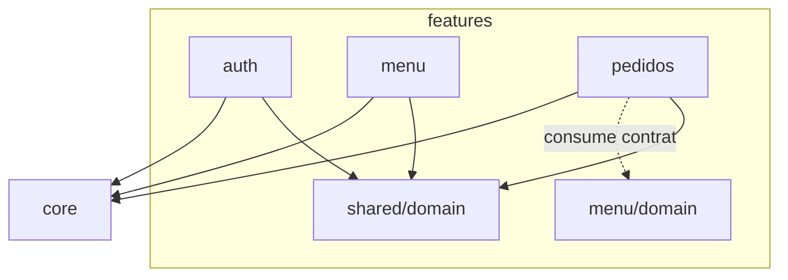

# Propuesta de División de Arquitectura — cómo crecer sin romperse

> [!info] Qué es esta nota
> [[Arquitectura Actual]] describe lo que **hay**. Esta nota propone **cómo dividir lo que vamos agregando**, fase por fase, con el punto exacto donde conviene cambiar de estructura. Responde al ítem **P-017** ("feature-first vs layer-first") de [[Deuda Técnica - Pendientes]], cuya ventana de decisión es la **Fase 2**.

---

## El problema en una frase

Hoy hay **un módulo** (`Login`) organizado **por capa** (`ui` / `domain` / `data` / `core`). Con un módulo, cualquier estructura funciona. Con seis (Menú, Pedidos, Mesas, Usuarios, Reportes), la organización por capa produce carpetas de 30 archivos donde nada relacionado está junto:

```
data/repository/  → SupabaseAuthRepository, MenuRepository, PedidoRepository,
                    MesaRepository, UsuarioRepository, ReporteRepository...
```

Para tocar "Pedidos" hay que abrir cuatro carpetas distintas. **La estructura deja de ayudar cuando el proyecto pasa de 2–3 features.**

---

## Lo que NO cambia, elijamos lo que elijamos

Estas reglas sobreviven a cualquier reorganización — son de [[Clean Architecture]] y [[SOLID]], no de una carpeta:

1. **`domain` nunca referencia `data`.** `data` implementa interfaces que `domain` define.
2. **`domain` no importa `android.*` / `androidx.*` / Retrofit / Room.** Es Java puro y testeable con JUnit sin emulador.
3. **`ui` habla solo con interfaces de `domain`.** Nunca con un DAO, un `ApiService` ni un DTO.
4. **Un `Result<T>` cruza las capas**, nunca una excepción cruda ([[Result Pattern]]).
5. **DTO ≠ entidad de dominio ≠ entidad de Room.** Tres tipos, con mappers explícitos. Es lo que permite que un cambio en la API no se propague a la UI.
6. **Todo I/O fuera del hilo principal**, con `Executor` inyectado ([[Asincronia en Java para Android]]).

---

## Propuesta 1 — Layer-first (lo actual) + subpaquete por módulo

```
com.example.proyectofinalrestaurante
├── ui/       login/ · menu/ · pedidos/
├── domain/   model/ · repository/ · usecase/
├── data/     remote/ · local/ · repository/ · mapper/
└── core/     SupabaseClient, interceptors
```

**A favor:** es lo que ya hay, cero migración; la separación de capas está visualmente forzada.
**En contra:** un feature queda desparramado en 4 sitios; borrar un feature obliga a cazar archivos; dos personas tocando features distintos chocan en las mismas carpetas.
**Techo:** ~3 features. Después estorba.

---

## Propuesta 2 — Feature-first dentro del módulo `app` ← *recomendada*

Cada feature es un paquete autocontenido con **sus propias capas adentro**; lo genuinamente compartido queda en `core` y `shared`.

```
com.example.proyectofinalrestaurante
├── core/                        infraestructura sin reglas de negocio
│   ├── network/                 SupabaseClient, AuthInterceptor, TokenAuthenticator
│   ├── database/                AppDatabase (Room, desde Fase 2)
│   └── util/                    Executors, formateadores
│
├── shared/                      dominio transversal (Java puro)
│   ├── domain/                  Result<T>, AppException, Sesion, Usuario
│   └── ui/                      BaseActivity, vistas de estado (cargando/vacío/error)
│
└── features/
    ├── auth/
    │   ├── domain/              AuthRepository, SesionRepository, LoginUseCase
    │   ├── data/                SupabaseAuthApi, dto/, SupabaseAuthRepository, local/
    │   └── ui/                  LoginActivity, LoginViewModel, EstadoLogin
    ├── menu/
    │   ├── domain/              Platillo, MenuRepository, ObtenerMenuUseCase
    │   ├── data/                MenuApi, MenuDao, MenuEntity, MenuRepositoryImpl, mapper/
    │   └── ui/                  MenuFragment, MenuViewModel, EstadoMenu, MenuAdapter
    ├── pedidos/                 (misma forma)
    ├── mesas/
    ├── usuarios/
    └── reportes/
```



**Reglas de convivencia entre features:**
- Un feature **nunca** importa el paquete `data` ni `ui` de otro feature. Si Pedidos necesita platillos, depende de `menu.domain.MenuRepository` (la interfaz), no de `MenuRepositoryImpl`.
- Si dos features necesitan lo mismo → sube a `shared/domain`, no se copia ni se importa cruzado.
- Dentro de un feature la regla de capas sigue viva: `ui → domain ← data`.

**A favor:** un feature = una carpeta (se lee, se prueba, se borra completo); escala a 6 features sin fricción; es el paso previo natural a multi-módulo Gradle.
**En contra:** una migración de una vez (mover `ui.login` → `features.auth.ui`, etc.); la separación de capas ya no está impuesta por la carpeta raíz, hay que sostenerla con disciplina y revisión.

**Cuándo hacerla:** al arrancar la **Fase 2**, *antes* de escribir el módulo Menú. Migrar un feature cuesta una tarde; migrar seis cuesta una semana.

---

## Propuesta 3 — Multi-módulo Gradle

```
:app                      navegación + composition root
:core:network             :core:database      :core:ui
:shared:domain            Java puro, sin Android
:feature:auth             :feature:menu       :feature:pedidos ...
```

**A favor:** el compilador **impone** las reglas (si `:shared:domain` no declara Android como dependencia, es imposible importar `android.*`); builds incrementales más rápidos; `:shared:domain` se testea con JUnit puro.
**En contra:** mucho `build.gradle.kts` que mantener; los ciclos de dependencia se vuelven errores de build que hay que resolver a mano; sobredimensionado para un proyecto de curso con un desarrollador.

**Cuándo:** solo si el proyecto llega a 5+ features **y** el build se vuelve molesto. Ver [[Modularizacion por Feature]].

---

## Recomendación

| Momento | Estructura |
|---|---|
| **Hoy (Fase 0 / 1)** | Propuesta 1 — no reorganizar mientras se arregla la deuda; un cambio a la vez |
| **Al empezar Fase 2 (Menú)** | **Migrar a Propuesta 2** en un commit dedicado `refactor:`, sin mezclar con código nuevo |
| **Fase 4 en adelante** | Seguir en Propuesta 2 |
| **Solo si duele el build** | Propuesta 3 |

> [!warning] Un commit, una cosa
> La migración de estructura va **sola** en su commit, sin cambios de comportamiento. Mezclar "moví 20 archivos" con "agregué el módulo Menú" hace el diff irrevisable.

---

## Cómo crece, fase por fase

| Fase | Qué se agrega | Dónde |
|---|---|---|
| **0** | Nada estructural — solo remediación (P-003, P-004, P-006…) | in situ |
| **1.5** | Sesión persistente + refresh (Propuesta B de [[Plan de Conexión con Supabase]]) | `features/auth/data/local/`, `core/network/` |
| **2 — Menú** | Migración a feature-first + **Room y outbox desde el día uno** | `features/menu/`, `core/database/` |
| **3 — Pedidos** | Primer feature que consume otro (`menu.domain`) + **single-Activity + Navigation** (P-015) | `features/pedidos/`, `:app` navegación |
| **4 — Mesas** | Feature simple; primer estado en tiempo real (si se usa Realtime) | `features/mesas/` |
| **5 — Usuarios/Roles** | El rol pasa a `shared/domain/Sesion` y condiciona la navegación | `shared/domain/`, `features/usuarios/` |
| **6 — Reportes** | Consultas agregadas — candidato natural a Edge Function (Propuesta D) | `features/reportes/` |

---

## Dónde entra el offline-first

[[ADR-005 - Offline-first obligatorio desde la Fase 2]] obliga a que desde el módulo Menú **Room sea la fuente de verdad de la UI**. En la Propuesta 2 eso cae naturalmente dentro de cada feature:

```
features/menu/data/
├── remote/   MenuApi, dto/          ← red
├── local/    MenuDao, MenuEntity    ← Room (fuente de verdad)
├── mapper/   dto ↔ entity ↔ dominio
└── MenuRepositoryImpl.java          ← decide red vs caché, encola en el outbox
```

La UI **solo** observa Room; la red actualiza Room. El `outbox` de escrituras pendientes es compartido → vive en `core/database/`. Ver [[Offline-First con Room y Outbox]].

---

## Cuándo aparecen los `UseCase`

Hoy no hay ninguno y está bien: `LoginViewModel` llama al repositorio directo, porque no hay lógica que agregar. Un `UseCase` se crea cuando pasa **una** de estas:

- La operación combina **dos o más repositorios** (ej. `CrearPedidoUseCase` = mesa + platillos + stock).
- La **misma** regla de negocio la necesitan dos ViewModels.
- El ViewModel empieza a tener lógica que querés testear sin `androidx.lifecycle`.

Crear un `UseCase` por cada método de repositorio solo agrega ruido. Ver [[Capa de Dominio]].

---

## Relaciones

- [[Arquitectura Actual]]
- [[Plan de Conexión con Supabase]]
- [[Roadmap de Fases]]
- [[Modularizacion por Feature]]
- [[Clean Architecture]]
- [[Capa de Dominio]]
- [[Offline-First con Room y Outbox]]
- [[Repository Pattern]]
- [[Result Pattern]]
- [[Deuda Técnica - Pendientes]]
- [[ADR-001 - Arquitectura por capas (ui-domain-data) en Android con Java]]
- [[ADR-005 - Offline-first obligatorio desde la Fase 2]]
